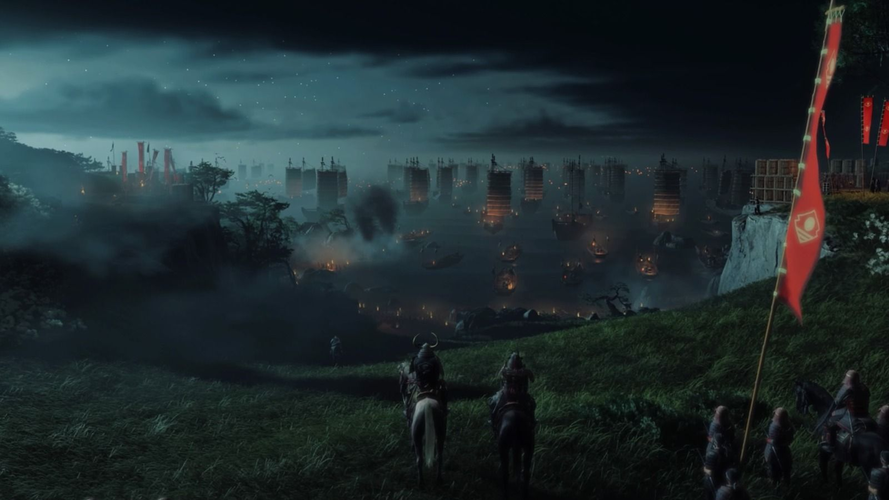
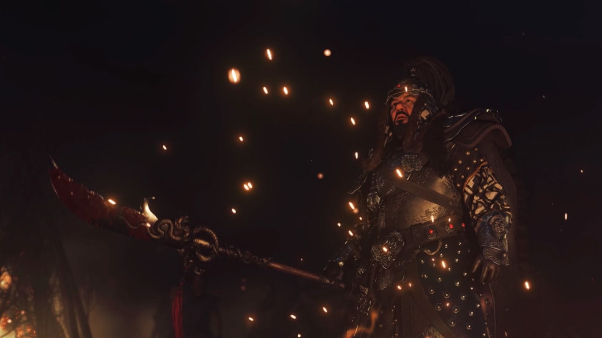
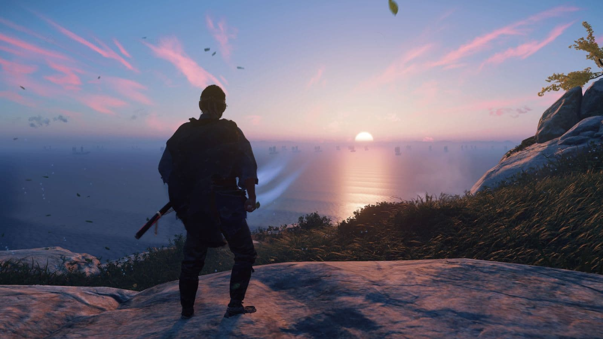
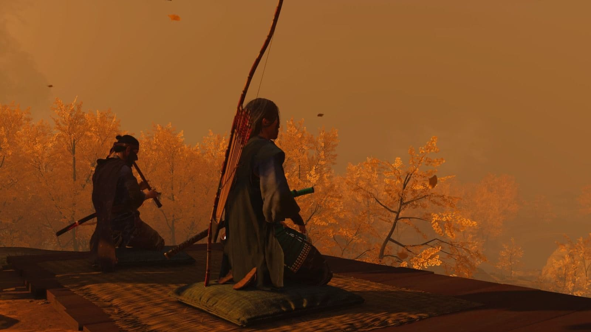
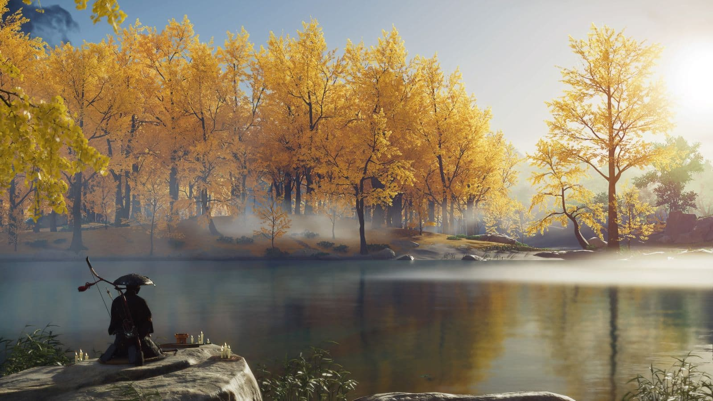

สรุปเนื้อเรื่องเกม Ghost of Tsushima อีกหนึ่งเกมจากค่าย Sucker Punch เกมนี้เราจะได้เล่นเป็นซามูไรชื่อว่า จิน ซาไค ที่ต้องต่อสู้กับการรุกรานของกองทัพมองโกล และต้องต่อสู้ทุกวิถีทางแม้กระทั้งผิดกฎของซามูไร เนื้อเรื่องจะเป็นยังไงไปอ่านกันได้เลย

> บทความนี้มีการเปิดเผยเนื้อหาภายในเกม

---

## เนื้อเรื่อง

การรุกรานญี่ปุ่นของทัพมองโกลนำโดย **โคตุนข่าน** บุกโจมตีเกาะซึชิมะบริเวณชายหาดโคโมดะ เหล่าซามูไรแปดสิบนายเดินทัพเข้าสู้เพื่อถ่วงเวลา แต่เกินกำลังที่จะต้านทานไหว ซามูไรทั้งหมดถูกฆ่าตายเหลือเพียง **แม่ทัพชิมูระ** ผู้นำ ถูกจับไปเป็นตัวประกันที่ปราสาทคาเนดะ หวังให้เข้าร่วมกับมองโกลเพื่อบุกตีแผ่นดินใหญ่

ซามูไรที่รอดจากชายหาดมีเพียง **จิน ซาไค** สมาชิกคนสุดท้ายของตระกูลซาไคและหลานชายของท่านชิมูระ โดยได้รับการช่วยเหลือจากหัวขโมยชื่อ **ยูนะ** เพื่อแลกกับการช่วยเหลือน้องชายของนางที่ถูกมองโกลจับตัวไป

เริ่มแรกจินและยูนะบุกไปยังปราสาทคาเนดะเพื่อช่วยท่านชิมูระ ประจันหน้ากับทัพมองโกลตามวิถีของซามูไร หลบหลีกแทรกซึมตามวิธีของยูนะ เมื่อถึงตัวปราสาท จินได้เผชิญหน้าและต่อสู้กับโคตุนข่าน แต่กลับจบลงด้วยความพ่ายแพ้ของจินที่ถูกผลักจากสะพานสูงจนตกน้ำไป

จินรอดจากความตายมาได้และรู้ว่าโคตุนข่านเตรียมรับมือกับวิถีซามูไรมาอย่างดี จึงคิดจะหาวิธีสู้ใหม่ที่คาดเดาไม่ได้ จินเลยกลับไปพบยูนะและเลือกที่จะไปช่วยเหลือน้องชายของยูนะที่เป็นช่างตีเหล็กก่อน เพื่อสร้างตะขอเหล็กปีนปราสาทสำหรับการบุกชิงตัวท่านชิมูระต่อไป

---

### บทที่ 1 : ช่วยท่านชิมูระ

การจะช่วยท่านชิมูระครั้งนี้จินต้องการกำลังคนเพิ่ม ได้แก่ **อาจารย์อิชิกาวะ** ซามูไรผู้เชี่ยวชาญด้านการใช้ธนู **ท่านหญิงมาซาโกะ** ภรรยาแห่งตระกูลอาดาจิ ซึ่งสามีตายในสนามรบที่หาดโคโมดะ กลุ่มทหารรับจ้างหมวกฟาง ที่ **ริวโซ** เพื่อนเก่าของจินเป็นผู้นำกลุ่ม และสุดท้ายคือ **ทากะ** น้องชายของยูนะ

ระหว่างออกตามหาทากะ จินบุกเข้าไปหาเบาะแสในค่ายของมองโกล สถานการณ์บีบบังคับให้จินต้องลอบฆ่าศัตรู ขัดกับกฎของซามูไรที่ต้องเผชิญหน้าและสู้กับศัตรูอย่างมีเกียรติ ซึ่งทำให้จินยอมผิดกฎทำในสิ่งที่จำเป็นต้องทำ เมื่อได้เบาะแสของทากะเพิ่ม จินจึงออกเดินทางตามหาทากะและคนที่เหลือต่อ

จินเดินทางไปขอความร่วมมือจากอาจารย์อิชิกาวะ ได้ทราบว่าอาจารย์ไม่ได้เข้าร่วมสงครามที่หาดโคโมดะเพราะถูกดักโจมตี และในตอนนี้ **โทโมเอะ** ลูกศิษย์มือหนึ่งของอาจารย์ได้เข้าร่วมกับทัพมองโกล จินจะช่วยอาจารย์สืบหาเบาะแสของเธอแลกกับการช่วยเหลือท่านชิมูระ

ฝั่งท่านหญิงมาซาโกะเสียสามีและลูกๆจากสงคราม อีกทั้งยังโดนกลุ่มผู้ร้ายบุกฆ่าล้างตระกูลจนหมด ทำให้ท่านหญิงกลายเป็นคนสุดท้ายที่เหลือรอดของตระกูล จินจะช่วยตามหาผู้ร้ายเหล่านั้นและท่านหญิงจะช่วยท่านชิมูระเป็นการตอบแทน

จินจะพบกับริวโซที่กลายมาเป็นผู้นำของกลุ่มหมวกฟาง ที่ตอนนี้กำลังอดอยากจากภาวะสงคราม จินจะช่วยหาเสบียงและช่วยกลุ่มหมวกฟางที่ถูกจับตัวโดยทัพมองโกล เพื่อกลุ่มหมวกฟางจะได้เข้าร่วมการชิงตัวท่านชิมูระ

ด้านของทากะนั้น ยูนะและจินจะแทรกซึมไปยังค่ายของมองโกลแห่งหนึ่ง หลังจากทราบว่าทากะถูกจับไปเป็นแรงงานอยู่ที่นั่น หลังจากช่วยทากะมาได้ จินจะบุกชิงโรงเหล็กคืนจากพวกมองโกล จากนั้นทากะจะสร้างตะขอเหล็กให้

เมื่อมีกำลังพลตามที่ต้องการและคืนที่ต้องบุกปราสาทมาถึง ทุกคนมากันพร้อมหน้ายกเว้นกลุ่มหมวกฟาง แต่ก็ไม่สามารถรอได้จึงจำเป็นต้องบุกและใช้คนเท่าที่มี จินใช้ตะขอเหล็กปีนปราสาทที่ทากะทำให้และร่วมกันบุกไปถึงชั้นในของปราสาท

ความจริงก็เปิดเผยเมื่อพบว่าริวโซเข้าร่วมกับทัพมองโกลเพื่อให้กลุ่มหมวกฟางอยู่รอด ริวโซหนีจากจินไปได้หลังพ่ายแพ้การดวลดาบ ส่วนจินเข้าช่วยท่านชิมูระไว้ได้และทราบว่าโคตุนข่านไม่อยู่ที่นี่ แต่บุกไปยึดปราสาทชิมูระและอาศัยอยู่ที่นั่นแทน

หลังจากยึดปราสาทคาเนดะมาได้ เป้าหมายต่อไปก็คือปราสาทชิมูระ จากการต่อสู้ที่ไม่เหมือนซามูไรของจินจนได้ฉายาว่า **ปีศาจ** ทำให้ท่านชิมูระตักเตือนถึงวิธีการดังกล่าว แนะนำให้กลับไปยังวิถีของซามูไรและไม่ให้ถลำลึกไปยังวิธีอันไร้เกียรติแบบที่ผ่านมา

---

### บทที่ 2 : ชิงปราสาทชิมูระ

จินและท่านชิมูระมีเป้าหมายว่าจะยึดปราสาทชิมูระคืนจากโคตุนข่าน ครั้งนี้ต้องอาศัยกองกำลังของยาริกาวะ และส่งจดหมายไปยังแผ่นดินใหญ่เพื่อขอความช่วยเหลือจากโชกุน

ดังนั้นจินจึงเดินทางไปยังยาริกาวะ ที่ซึ่งเป็นบ้านเก่าของยูนะและทากะที่ตอนนี้กำลังโดนปิดล้อมโดยทัพมองโกล ทั้งสามจะเข้าร่วมกันกับชาวบ้านขับไล่ทัพมองโกลไปได้ และยาริกาวะก็ตกลงเข้าร่วมชิงปราสาทชิมูระกลับคืน

จากนั้นจินจะออกตามหานักเดินเรือชื่อโกโร่ที่ติดหนี้บุญคุณท่านชิมูระ เพื่อให้เดินเรือไปยังแผ่นดินใหญ่ส่งสารขอกำลังเสริมจากท่านโชกุน จินและท่านชิมูระจะช่วยกันเบี่ยงเบนความสนใจของทัพมองโกล และเปิดทางให้โกโร่เดินเรือได้อย่างปลอดภัย ท่านชิมูระยังเปิดเผยว่าในสารถึงโชกุนยังมีคำขออุปการะจินเป็นลูกบุญธรรมอีกด้วย

ท่านชิมูระจะยังให้จินกลับไปเอาชุดเกราะตระกูลซาไคจากบ้านเก่าของจินด้วย จินจะได้เจอกับป้ายูริโกะคนดูแลบ้าน ได้นึกถึงวันเก่าๆที่นั่น จินจะขอให้ป้าสอนทำยาพิษให้เพื่อเอาไปใช้กับพวกมองโกล

ก่อนจะบุกปราสาท จะได้ข่าวว่ากลุ่มหมวกฟางตั้งค่ายกันอยู่ จินและทากะจึงออกไปจัดการ แต่ที่จริงเป็นแผนลวงจนโดนจับได้ทั้งคู่ โคตุนข่านให้ดาบกับทากะเพื่อให้ฆ่าจิน แต่ทากะไม่ยอม โคตุนข่านเลยฆ่าทากะตายต่อหน้าจิน สุดท้ายจินหนีออกมาได้และกลับไปสมทบกับพรรคพวกเพื่อบุกปราสาทชิมูระต่อไป

เมื่อทุกอย่างพร้อม จินและท่านชิมูระรวมด้วยกองทัพพันธมิตรก็บุกเข้าโจมตีปราสาท ฝั่งจินตีฝ่าทัพมองโกลจนถอยร่นข้ามสะพานไปยังปราสาท กองทัพฝั่งจินไล่ตามแต่ติดกับ ถูกฝั่งมองโกลระเบิดสะพานจนเสียคนไปมาก ท่านชิมูระจึงตัดสินใจพักรบเพื่อบุกโจมตีอีกครั้งในวันถัดไป แต่จินไม่เห็นด้วยที่จะพาคนไปตายเพิ่มและอยากที่จะใช้ยาพิษวางยาทัพมองโกล จินและท่านชิมูระจึงมีปากเสียงกัน

สุดท้ายจินจึงลอบบุกปราสาทชิมูระตามลำพัง และวางยาชาวมองโกลทั้งหมด ถึงจินจะไม่ได้เจอข่าน แต่ได้เจอกับริวโซและดวลดาบกันจนริวโซเสียชีวิต เป็นอันยึดปราสาทกลับคืนมาได้สำเร็จ

ท่านชิมูระไม่พอใจถึงวิธีการที่ไร้เกียรติของจิน จินเรียกตัวเองว่าเป็นนักรบปีศาจ ทำให้ท่านชิมูระเผาศาสน์ตอบรับการเป็นลูกบุญธรรมของจินทิ้ง จับจินไปขังเนื่องจากฝ่าฝืนคำสั่ง จนแล้วจนรอดจินหลบหนีออกจากคุกมาได้ และเดินทางขึ้นเหนือเพื่อตามหาโคตุนข่านต่อไป

---

### บทที่ 3 : สังหารข่าน

จากเหตุการณ์วางยาพิษมองโกล ทำให้จินต้องหนีจากท่านชิมูระและทัพมองโกลมาตั้งหลักทางตอนเหนือ ระหว่างทางจะเห็นชาวบ้านถูกวางยาพิษตาย เพราะชาวมองโกลสามารถแกะสูตรยาพิษของจินและเอากลับมาใช้กับชาวซึชิมะแทน

จากนั้นจินจะได้พบกับยูนะและรู้ข่าวว่าโคตุนข่านถอยไปกบดานอยู่ที่ท่าเรืออิซึมิ จินจึงคิดว่าจะหาจุดรวมพลโดยเลือกที่จะบุกชิงวัดโจงากุจากทัพมองโกล เพื่อที่จะตั้งหลักกันอยู่ที่นั่น

ถึงแม้ว่าจะแยกทางกันกับท่านชิมูระ แต่ยังมีกองทัพและคนสำคัญที่ยังคอยสนับสนุนอยู่ ไม่ว่าจะเป็นอาจารย์อิชิกาวะ ท่านหญิงมาซาโกะ พระโนริโอะ และกองทัพยาริกาวะ

เมื่อส่อเค้าเกิดพายุ จินสบโอกาสจะใช้พายุในการลอบบุกเข้าโจมตีทัพมองโกล แต่ถึงอย่างนั้นก็อาจไม่เพียงพอ จินเลยลอบบุกเข้าปราสาทชิมูระตามลำพังและทิ้งจดหมายไว้ หวังให้กองทัพของท่านชิมูระช่วยเหลือ ก่อนกลับมาเตรียมตัวเพื่อบุกทัพมองโกลในวันถัดไป

จินนำทัพมาถึงท่าเรืออิซึมิพร้อมบุกเข้าโจมตีทัพมองโกลและได้เจอกับโคตุนข่าน ข่านและกองทัพมองโกลเริ่มใช้ยาพิษเข้าต่อสู้ แต่จินค่อยๆรุกไล่ฝ่ากองทัพจนสังหารโคตุนข่านลงได้

หลังสิ้นศึกที่ท่าเรืออิซึมิ ท่านชิมูระส่งสารมาเพื่อนัดพบกับจิน เมื่อไปถึงจึงรู้ว่าโชกุนสั่งยุบตระกูลซาไคและสั่งท่านชิมูระเพื่อมาสังหารจิน ทำให้ทั้งคู่ต้องดวลดาบกันและในท้ายที่สุด จินจะต้องเลือกว่าจะไว้ชีวิตท่านชิมูระหรือสังหารท่านเสีย

---

เป็นอย่างไรบ้างครับกับสรุปเกมเกมนี้ หวังว่าจะถูกใจสายอ่านกันนะครับ ไว้ยังไงเจอกันใหม่บทความหน้า และขอปิดท้ายด้วยภาพภายในเกมนี้ครับ

