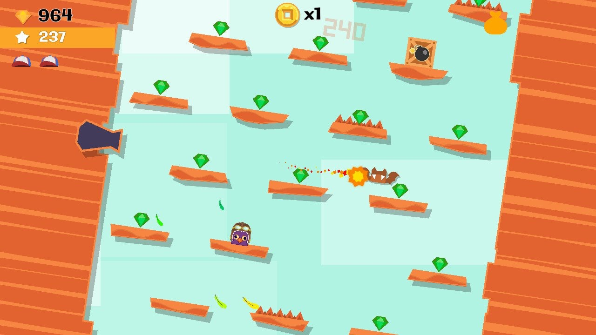
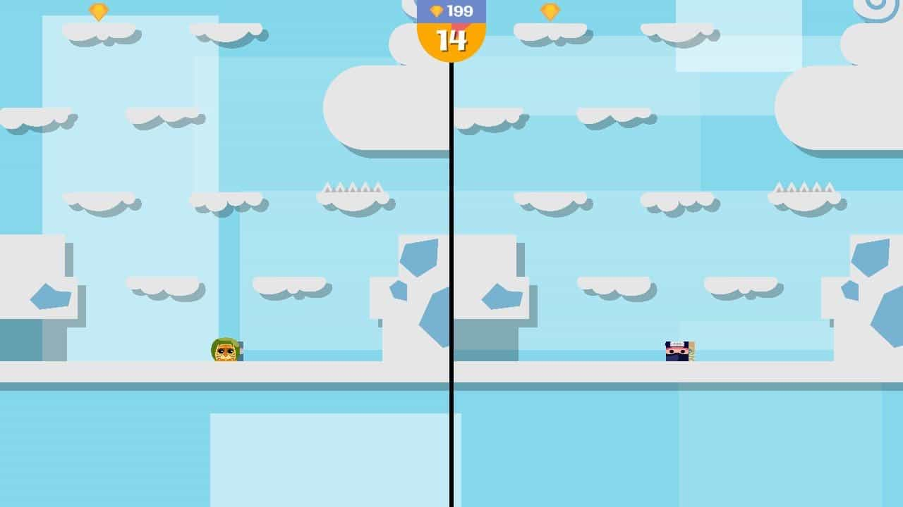
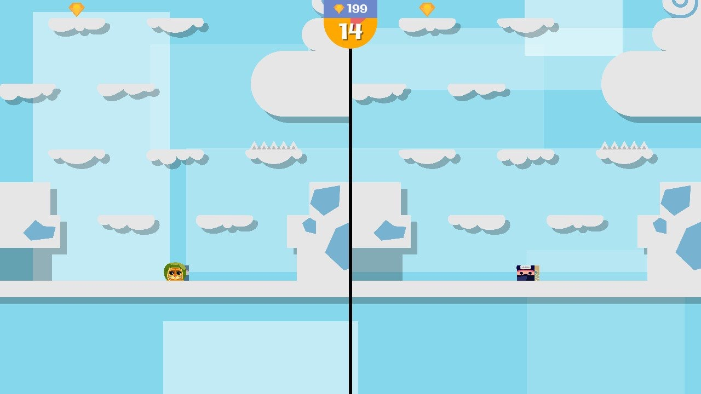

สำหรับใครที่กำลังหาเกมราคาย่อมเยาว์บน Nintendo Switch มาเล่นกับเพื่อนแล้วเนี่ย ผมบอกเลยว่า <a href="https://www.nintendo.com/games/detail/jumping-joe-and-friends-switch" target="_blank">Jumping Joe & Friends</a> เกมนี้ ซื้อมาเล่นแล้วคุ้มค่าแน่นอน จะไม่คุ้มได้ยังไงล่ะ **ผมซื้อมาตอนลดราคา 8.15 บาท!!** (ราคาเต็ม \$1.99) วันนี้ก็เลยจะมาเล่าเกมให้ฟัง

ตัวเกมก็ง่ายๆครับ **กระโดดขึ้นไปทีละขั้นๆ กดอยู่แค่สองปุ่มซ้ายกับขวา แค่นั้นฮะ!!** แต่ความสนุกมันอยู่ตรงอุปสรรคนี่แหละครับ กระโดดขึ้นไปก็มีอะไรไม่รู้ขวางเต็มไปหมด ไม่ว่าจะเป็นค้างคาว, พื้นหนาม, กงจักร บลาๆ

ระหว่างทางก็จะมีไอเท็มให้เก็บนะ เช่น พลังชีวิต, ระเบิดไว้ทำลายสิ่งกีดขวาง, จรวดเก็บแล้วพุ่งขึ้นไปหลายชั้นเลย นอกจากนั้นก็มีเหรียญให้เก็บเพื่อเอามาปลดล็อคโหมดต่างๆ และซื้อตัวละครเพิ่มด้วย

เกมนี้ถ้าจะเอาไปเล่นกับเพื่อนก็ได้สูงสุดสี่คนกันเลย วิธีเล่นก็แข่งกันโดดไปมานี่แหละครับ หมดเวลาใครไปได้ไกลกว่าคนนั้นชนะ หรือถ้าโดนอุปสรรคจนตายก็ถือว่าแพ้ไป

เกมดีราคาถูกแบบนี้ซื้อติดเครื่องไว้เล่นกับเพื่อนก็สนุกดีนะครับ ไว้เจอกันใหม่บทความหน้าครับ
