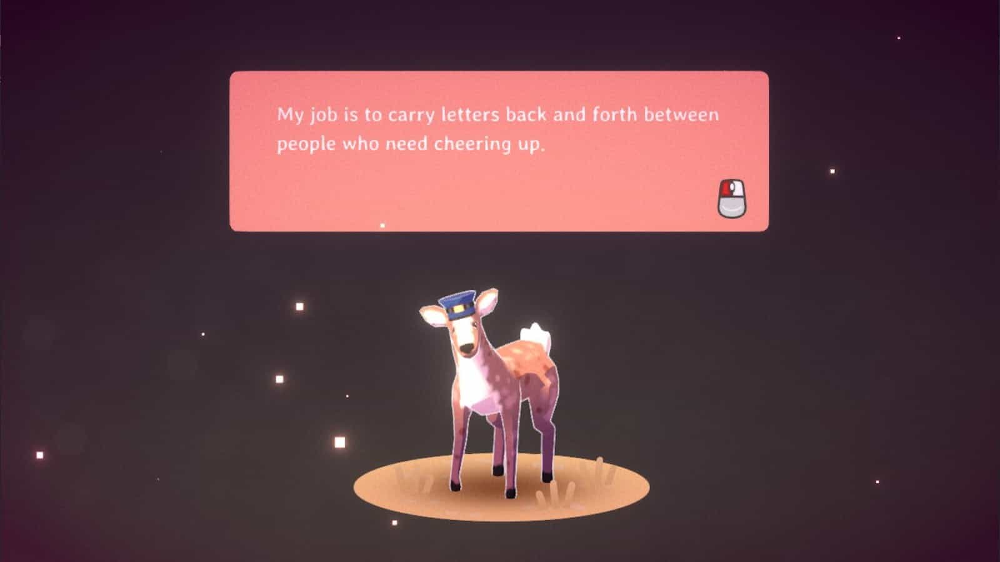
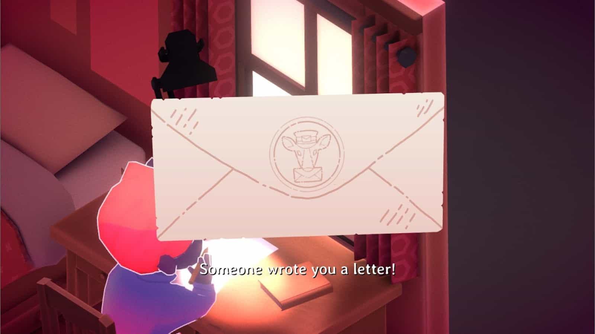
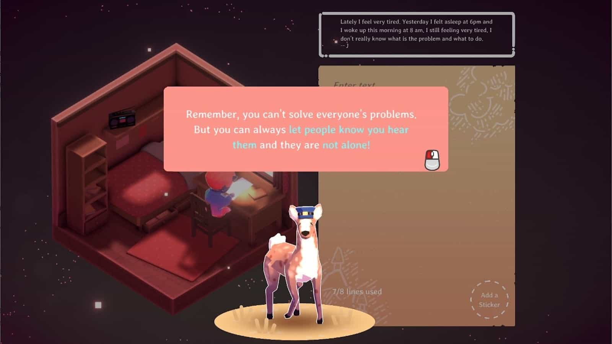

**Kind Words** เป็นเกมที่ให้เราเขียนจดหมายระบายความทุกข์ใจ หรือจะคอยเป็นฝ่ายให้กำลังใจผู้อื่น โดยการเขียนจดหมายตอบกลับคนอื่นๆ ก็ได้เช่นกัน

ฉากของเกมก็จะมีฉากเดียวเลยครับ เป็นเด็กน้อยนั่งเขียนจดหมายอยู่ในห้อง ในบางครั้งก็จะมีเจ้ากวางไปรษณีย์ที่จะคอยมารับจดหมายหรือเอาจดหมายของเราไปส่งให้คนอื่นๆ ในเกม

## มาเขียนจดหมายกัน

เวลาเราส่งจดหมายไปหาผู้อื่น ข้อมูลของเราจะไม่ถูกเปิดเผยนะครับ **ตัวเกมก็จะเน้นย้ำด้วยว่าไม่ให้เราใส่ข้อมูลส่วนตัวลงไปในจดหมายนะ เขียนลงไปแค่ความรู้สึกก็พอ** เมื่อส่งแล้วจดหมายก็จะถูกแจกจ่ายไปยังผู้เล่นคนอื่นๆ เขาเหล่านั้นก็จะส่งจดหมายให้กำลังใจกลับมาให้เรา

ในการตอบกลับ เราก็จะเห็นจดหมายของผู้อื่น แต่ไม่รู้ว่าเป็นของใครนะ เราสามารถเข้าไปอ่านและตอบจดหมายพร้อมแนบสติ๊กเกอร์ไปให้ได้ด้วย ซึ่งสติ๊กเกอร์เหล่านั้นก็จะกลายมาเป็นของตกแต่งห้องได้อีกด้วย

ด้วยความที่มันเป็นจดหมาย มันก็จะไม่ใช่การคุยกันไปกันมานะ ขั้นตอนมันก็มีแค่ **1.เราส่งจดหมายระบายเรื่องราว -> 2.มีคนมาตอบจดหมายพร้อมส่งสติ๊กเกอร์ -> 3.เราส่งสติ๊กเกอร์กลับไปเพื่อขอบคุณ** นี่คือสามขั้นตอนในการโต้ตอบจดหมายในเกมนี้ครับ

## เขียนจดหมายไปกับเพลงเพราะๆ

เกมนี้มีดนตรีประกอบเป็นแนว Lo-fi hip hop ส่วนใหญ่ก็จะฟังสบายๆ บางคนฟังเพลงแนวนี้เพื่ออ่านหนังสือบ้าง ทำงานบ้าง หรือฟังก่อนนอนก็มี

เราสามารถเปลี่ยนเพลงได้โดยกดที่เจ้าวิทยุนะ ช่วงแรกๆ จะมีให้ฟังไม่เยอะ แต่พอเล่นไปเรื่อยๆ เจ้ากวางจะเอาเพลงมาให้เราเพิ่ม

ลองมาฟังตัวอย่างเพลงแนวนี้กัน

`youtube:https://www.youtube.com/watch?v=bfzwNuiqo7E`

## บนโลกนี้มีคนทุกข์ใจเยอะนะ

ผมลองเล่นแล้วก็เห็นคนมีปัญหาเยอะแยะมากมาย บางคนเครียดเรื่องงาน บางคนมีปัญหากับครอบครัว น้องๆบางคนเครียดเรื่องเรียน บางคนเจอเรื่องแย่ๆเกี่ยวกับความรัก

ผมชอบประโยคนึงที่เกมบอกกับเรานะ **"เราไม่สามารถแก้ไขปัญหาของทุกคนได้ แต่เราสามารถบอกเขาได้ว่าเรารับฟัง และเขาไม่ได้อยู่คนเดียว"** ผมว่าการให้กำลังใจกันเป็นสิ่งที่ดีนะ

แต่หากใครมีปัญหาชีวิตจริงๆ หรือไม่แน่ใจว่าตัวเองป่วย ยังไงผมแนะนำให้พบแพทย์หรือผู้เชี่ยวชาญเฉพาะทางดีกว่านะ ที่นี่เป็นสังคมกำลังใจ แต่ว่าการบำบัดหรือการรักษายังไงก็ต้องเป็นแพทย์หรือผู้เชี่ยวชาญเนอะ

## สังคมและผู้คนที่อบอุ่น

อดพูดไม่ได้กับสังคมที่ดีมากๆ สารภาพว่าตอนผมรู้คอนเซปของเกมนี้ ผมเดาว่าเกรียนต้องเยอะแน่ๆ แต่พอเข้าไปจริงๆ กลับเจอกับสังคมดีที่มากๆ ต่างให้กำลังใจกัน ถึงแม้ว่าจะมีฟีจเจอร์ให้เรากดรีพอร์ทจดหมายที่ไม่เหมาะสมได้ แต่ผมยังไม่เคยเจอจดหมายเกรียนๆเลยสักฉบับเดียว

หากใครสนใจก็สามารถเข้าไปซื้อกันได้นะครับ ใน steam ราคา 99 บาทครับ เชื่อว่าถ้าใครได้เข้าไปลองเล่นดู ได้พบเจอกับสังคมและผู้คนดีๆในนั้น ก็คงอิ่มเอมใจไม่น้อยเลยทีเดียว
