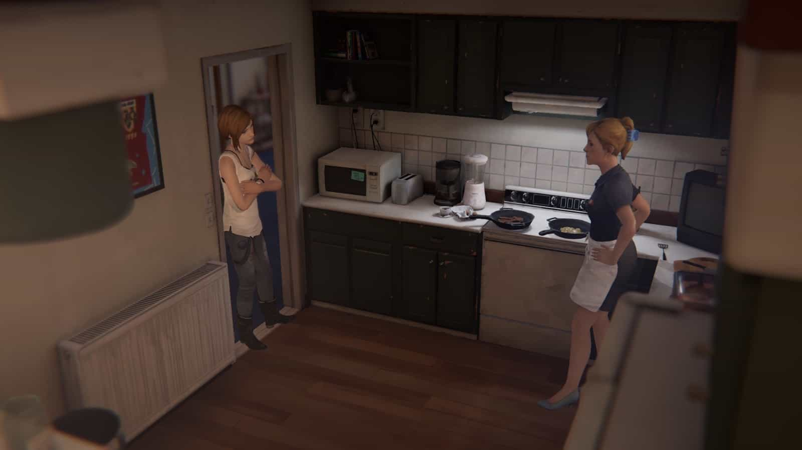
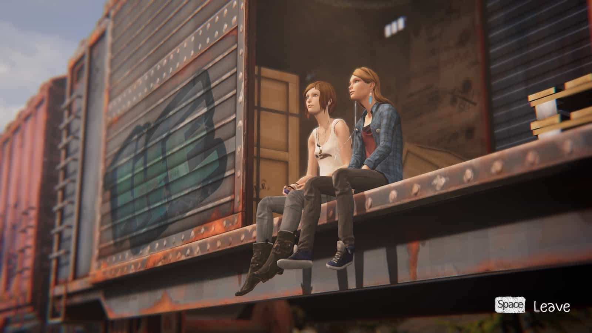
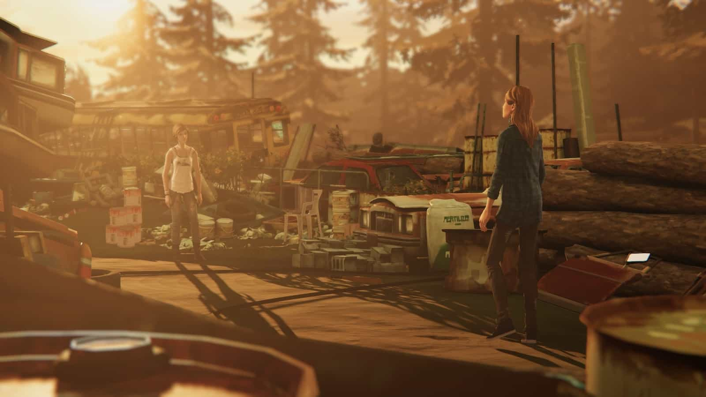
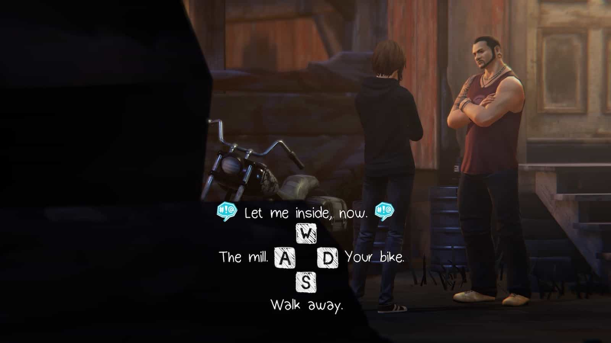

เกมนี้เป็นภาคแยกที่จะเติมเต็มเนื้อเรื่องจากภาคหลัก โดยภาคนี้เราจะได้เล่นเป็น**โคลอี้ ไพรซ์** ที่กำลังเจอปัญหาชีวิตรุมเร้า ทั้งความเสียใจที่พ่อของเธอเสียชีวิตจากอุบัติเหตุ หลังจากนั้นแม่ของเธอก็มีแฟนใหม่ที่ภายหลังทำตัวเจ้าระเบียบกับเธอ ทั้งเพื่อนสนิทคนเดียวย้ายไปเรียนที่อื่นและแทบไม่ได้ติดต่อกันเลย

โคลอี้เริ่มใช้ชีวิตออกนอกลู่นอกทางมากขึ้น เริ่มใช้ยา และเริ่มติดเงินพ่อค้ายา มีปัญหาทะเลาะกับแม่และแฟนใหม่ของแม่อยู่เป็นประจำ

แต่วันนึงกลับมีหญิงสาวที่เป็นคนดังประจำโรงเรียนอย่าง**เรเชล แอมเบอร์**เข้ามาอยู่ในชีวิต คอยเติมเต็มในช่วงเวลาที่เธอจมอยู่กับปัญหา ความสัมพันธ์ของทั้งคู่ค่อยๆ เพิ่มขึ้นเรื่อยๆ จากคนรู้จักกลายเป็นเพื่อน จากเพื่อนกลายเป็นเพื่อนสนิท

เรเชลเป็นคนมีพรสวรรค์ด้านการแสดง เป็นที่รักของผู้คนมากมาย เธอมีความฝันที่จะไปเป็นดารา ในเมืองใหญ่ ชีวิตของเธอดูเหมือนจะมีความเพรียบพร้อม แต่ภายในใจเธอก็เจอกับปัญหาเช่นกัน เธอเปิดใจกับโคลอี้ และโคลอี้ก็เปิดใจกับเธอเช่นกัน

ทั้งคู่เริ่มใช้ชีวิตด้วยกันมากขึ้น ใกล้ชิดกันมากขึ้น เราจะได้เห็นตัวละครพัฒนาความสัมพันธ์ไปด้วยกัน ที่เหลือผมให้ทุกคนลองไปเล่นกันเองดีกว่าละกันนะครับ เพื่อที่จะได้อินกับเนื้อเรื่องขึ้น

---

ในภาคนี้เราไม่ได้เล่นเป็นแมกซ์ คลอวฟิลด์ที่มีพลังย้อนเวลาเหมือนกับภาคที่แล้ว สิ่งที่เราจะได้มาแทนจากโคลอี้คือการบลัฟหรือเถียงให้ชนะฝั่งตรงข้าม ซึ่งเราก็จะต้องจับประเด็น หาจุดที่จะเถียงให้ชนะให้ได้

นอกจากนั้นก็ยังมีปากกาที่โคลอี้พกติดตัวไปเพื่อขีดเขียนระบายความรู้สึกตามจุดต่างๆ ซึ่งก็เป็น achievement ของเกมนี้ด้วย

---

ส่วนตัวรู้สึกว่าภาคเสริมนี้เน้นไปที่เนื้อเรื่องมากๆ เราจะได้เห็นช่วงเวลาที่เป็นช่องว่างที่ขาดหายไปในภาคแรก ก็จะเข้าใจเนื้อเรื่องภาคแรกได้มากขึ้นครับ
