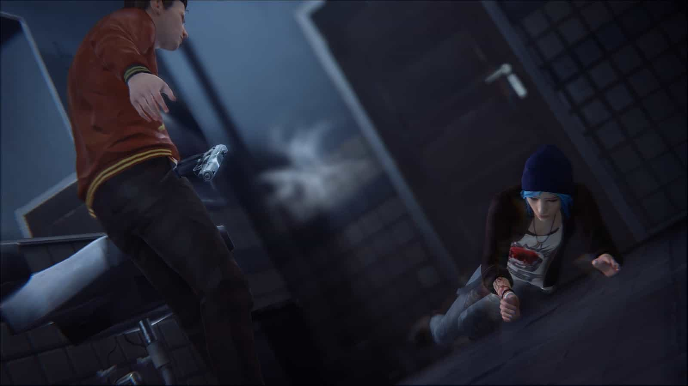
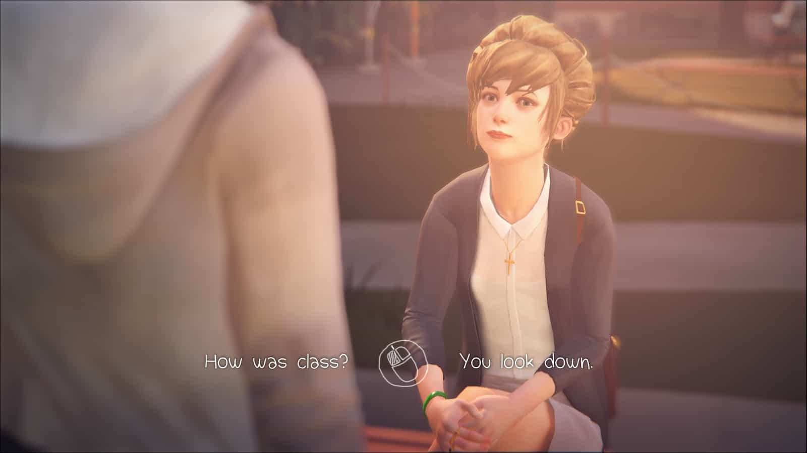
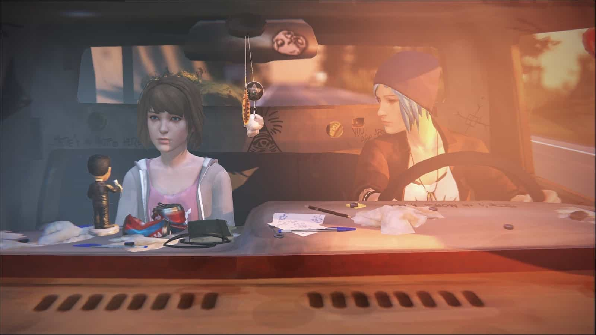
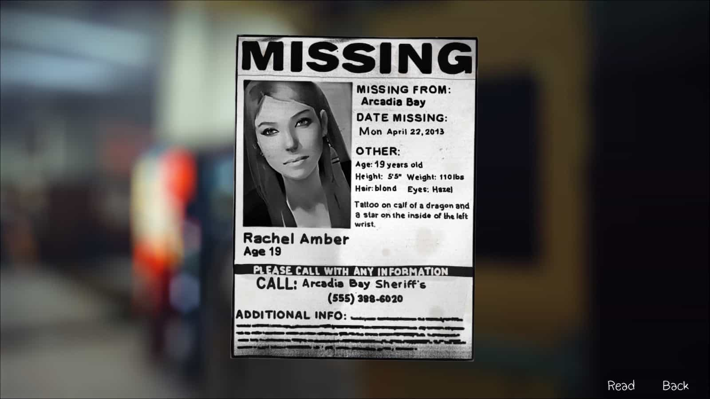
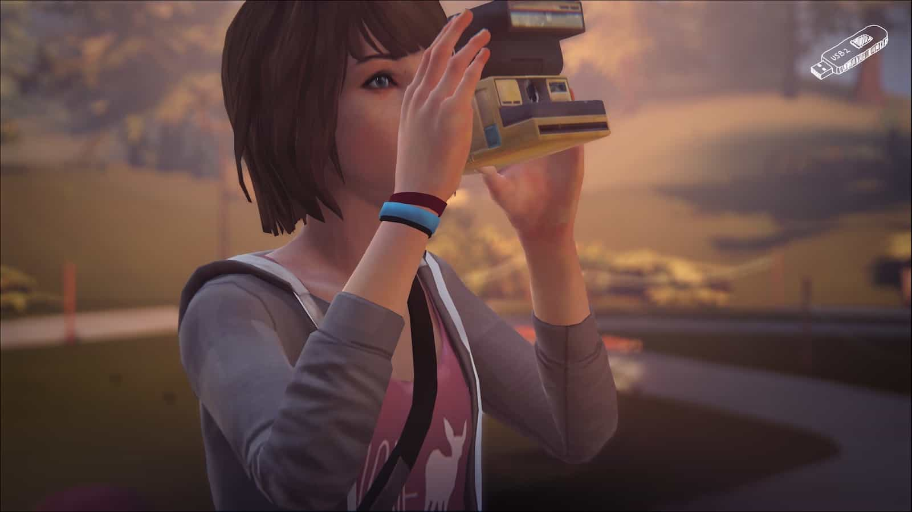

เกมสำหรับสายเสพเนื้อเรื่อง เราจะได้สวมบทเป็นแมกซ์ คลอวฟิลด์ นักเรียนประจำโรงเรียนแบล็กเวล เธอกลับมาเรียนที่บ้านเกิดนี้หลังจากไปเรียนที่ซิแอตเทิลมาห้าปี จากนี้เรื่องวุ่นๆ ก็เกิดขึ้น

ช่วงแรกของเกมจะเป็นการทิ้งปมต่างๆ ไว้มากมาย ที่ชัดที่สุดก็ไม่พ้นเรื่องที่เธอสามารถย้อนเวลาได้ จากการที่เธอได้ช่วยเหลือสาวพังค์ผมฟ้าที่โดนยิงจากนาธาน แพรสคอทด้วยการย้อนเวลาช่วยเหลือเอาไว้ได้

การย้อนเวลาได้ทำให้เราสามารถกลับไปแก้อตีดได้ ไม่ว่าจะเกิดเหตุการณ์ที่ไม่พึงพอใจเราก็สามารถย้อนมาแก้ไขได้เสมอ ไม่เว้นแม้แต่การตอบคำถาม ถ้าตอบแล้วไม่โอเค ก็ย้อนกลับมาแก้ไขได้เหมือนกัน ถึงแม้จะดูเป็นเรื่องง่าย แต่เชื่อเถอะ ถ้ามันไม่มีถูกไม่มีผิด ต่อให้ย้อนเวลากลับมาแก้ไขได้ ก็ยากที่จะตัดสินใจอยู่ดี

ตัวเลือกหรือการกระทำแต่ละอย่างจะส่งผลต่างๆ ตามมาไม่ช้าก็เร็ว เหตุการณ์ที่เพิ่งเกิดใกล้อาจจะพอย้อนเวลาได้ แต่บางเหตุการณ์ที่ผ่านไปนานแล้ว ก็จะแก้ไขอะไรไม่ได้

เนื้อเรื่องจะดำเนินไปจนได้พบกับสาวผมฟ้าอีกครั้ง คราวนี้แมกซ์จะจำได้แล้วว่าเธอคือโคลอี้ ไพรซ์ เพื่อนสนิทซี๊ปึ๊กที่ไม่ได้เจอกันนานกว่าห้าปี

เราจะได้เห็นความสัมพันธ์ของเพื่อนทั้งสอง ทั้งเรื่องอดีตที่ทั้งคู่สนิทกันมาก และชีวิตของโคลอี้ที่เปลี่ยนไปหลังจากพ่อเสียชีวิตและแมกซ์เพื่อนสนิทเพียงคนเดียวได้หายไปไร้การติดต่อ แมกซ์จะทราบว่าโคลอี้ใช้ยา ติดเงิน และใช้ชีวิตสุดเหวี่ยงเปลี่ยนไปราวกับคนละคนเลยทีเดียว

ด้วยความที่เป็นเพื่อนสนิทกันแมกซ์จึงบอกว่าเธอสามารถย้อนเวลาได้ และเราก็ได้ใช้มันกับโคลอี้ไม่ว่าจะเป็นเอามาเล่นสนุก หรือช่วยเหลือเพื่อนในยามทุกข์ร้อน จนแมกซ์ก้ได้รู้ความจริงอีกอย่างว่าพลังของเธอก็มีขีดจำกัดเช่นกัน

และวันที่เธอใช้พลังเกินลิมิตก็มาถึง จากการที่เคทเพื่อนร่วมชั้นที่ดูจะเศร้าซึมอยู่ตลอดเวลาเลือกที่จะจบชีวิตตัวเองจากด้วยการกระโดดตึกตาย แมกซ์ได้ย้อนเวลากลับไปถึงก่อนที่เคทจะกระโดดตึก แต่จากการใช้พลังที่มากเกินไปทำให้ไม่สามารถย้อนเวลาได้อีก สิ่งเดียวที่ทำได้คือเดินเข้าไปกล่อมไม่ให้เคทกระโดดลงมา และนั่นหมายถึงชะตาชีวิตของเคทขึ้นอยู่กับทุกคำพูดของเรานั่นเอง

ตลอดเวลาที่อยู่ในโรงเรียน จะเห็นประกาศคนหาย ชื่อเรเชล แอมเบอร์ จากนั้นเราจะทราบภายหลังว่าคนที่ติดประกาศก็คือโคลอี้ หลังจากที่แมกซ์หายไปจากชีวิตของโคลอี้ เธอเจอกับปัญหาชีวิตที่พอเสียชีวิตและแม่ของเธอเริ่มต้นชีวิตใหม่กับเดวิด รปภ สุดเนี๊ยบประจำโรงเรียน ซึ่งความเจ้าระเบียบของเขาทำให้โคลอี้เริ่มใช้ชีวิตเปลี่ยนไป ทั้งติดยา และค้างค่ายา

แต่สิ่งหนึ่งที่เปลี่ยนไปคือเธอได้พบกับเรเชลซึ่งเข้ามาเป็นเพื่อนใหม่ของเธอ แมกซ์ทราบคร่าวๆ แค่ว่าทั้งคู่สนิทกัน และวันหนึ่งเรเชลก็หายตัวไป ทำให้โคลอี้เสียใจเป็นอย่างมาก และนั่นเป็นที่มาของใบประกาศคนหายที่ติดอยู่ทั่วโรงเรียน

ความเชื่อมโยงหนึ่งของเคทและเรเชลคือทั้งคู่เคยได้ไปปาร์ตี้กับ vortex club เคทได้มีคลิปหลุดจากที่นั่น และที่นั่นก็เป็นที่สุดท้ายที่มีคนเห็นเรเชลก่อนจะหายตัวไป แมกซ์และโคลอี้จึงร่วมกันสืบหาข้อมูลว่าเกิดอะไรขึ้นกับเรเชล

---

แนวทางการเล่นเกมก็จะเน้นไปทางการตอบคำถามหรือการกระทำจากเหตุการณ์ต่างๆ โดยเราสามารถใช้การย้อนเวลาเข้าช่วยได้ ซึ่งทุกๆ การกระทำมีผลที่ตามมาเสมอ ความสนุกของมันก็คือ ต่อให้เราสามารถย้อนเวลาได้ บางการกระทำก็ไม่มีถูกหรือผิดอยู่ดี ดังนั้นต้องคิดดีๆ ก่อนตัดสินใจ

บางครั้งเราก็ต้องเดินสำรวจตามจุดต่างๆ หรืออาจจะต้องย้อนเวลาช่วยเหลือผู้อื่น เช่น เพื่อนที่นั่งอ่านหนังสือจะโดนลูกบอลอัดหัว เราก็สามารถย้อนเวลาไปก่อนหน้านั้น แล้วรีบไปเตือนให้เพื่อนหลบลูกบอลได้ ถือว่าตัวเกมมีการแก้พัซเซิลที่สนุกและใช้การย้อนเวลาได้ดีเลยทีเดียว

การเก็บรางวัลของเกมนี้อาจจะไม่เกี่ยวกับเนื้อเรื่องเท่าไหร่ แต่เป็นการแสดงถึงตัวตนของแมกซ์ได้ดีเลย เพราะเราต้องใช้กล้องฟิลม์ในการถ่ายภาพตามจุดต่างๆ บางจุดก็เดินไปถ่ายตรงๆ ได้เลย แต่บางจุดอาจจะต้องทำอะไรบางอย่างก่อน เพื่อให้ถ่ายรูปได้ เช่น ถ้าจะถ่ายกระรอก ก็ต้องเอาอาหารไปให้มันก่อน มันถึงจะอยู่นิ่งๆ ให้เราถ่ายได้

แน่นอนว่าเกมแนวๆ นี้แต่ละคนที่เข้ามาเล่นจะต้องมีการตัดสินใจที่แตกต่างกันไปอยู่แล้ว ตัวเกมก็จะมีสรุปให้ด้วยว่าผู้เล่นคนอื่นๆ ตัดสินใจอย่รงไรบ้าง แล้วเราอยู่ในกลุ่มกี่เปอร์เซ็นต์

---

สุดท้ายแล้วนี่เป็นเกมเนื้อเรื่องที่ผมชอบมากๆ ทั้งเรื่องราวที่เล่นไปก็อินไป ภาพก็สวย ที่สำคัญเพลงเพราะมากๆๆๆ ถ้าใครเป็นสายเนื้อเรื่องผมแนะนำว่าไม่ควรพลาดเลยครับ ที่สำคัญเกมนี้ยังมีภาคแยกเป็นเรื่องราวของโคลอี้และเรเชลอีกครับ ซึ่งผมเล่นจบไปแล้วเช่นกัน ยังไงบทความหน้าจะมาเล่าเกมภาคต่อไปให้อ่านกันนะครับผม
