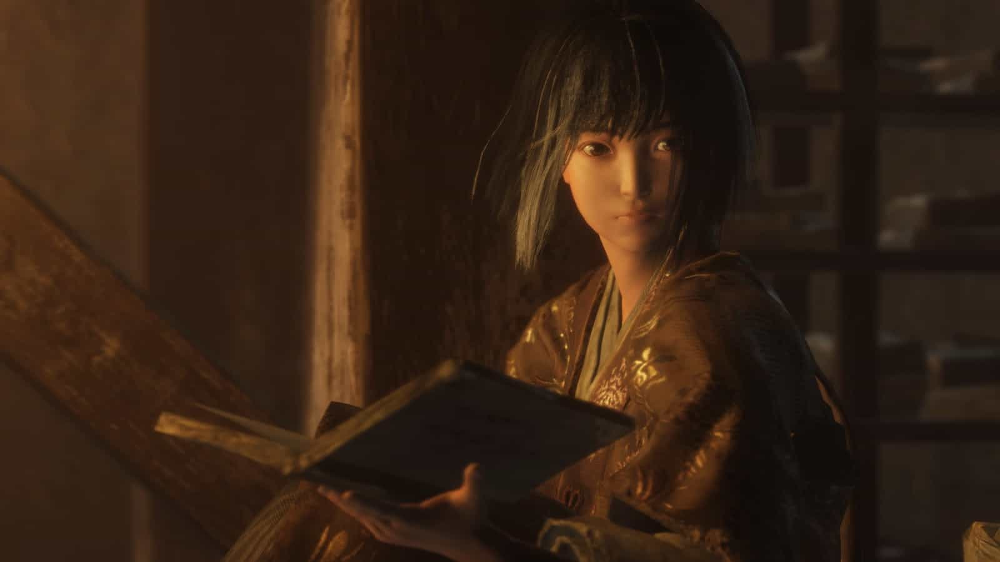
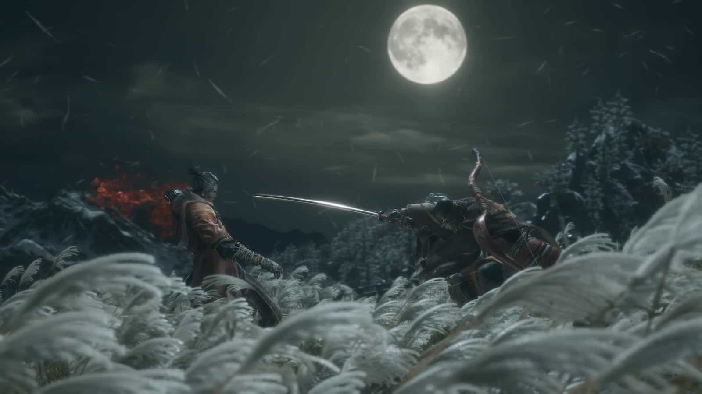
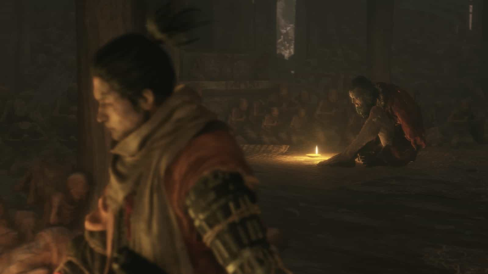
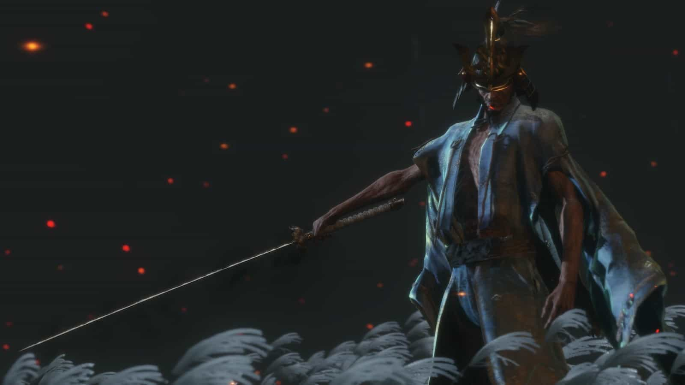
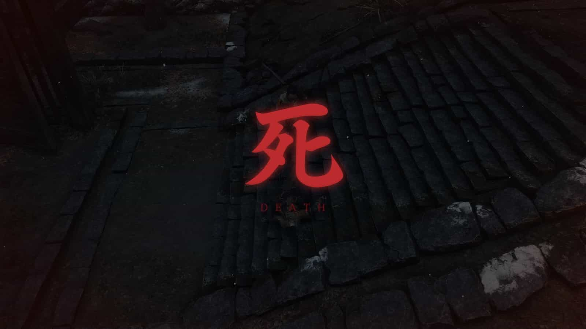

เจ้าของรางวัลผลงาน Game of the year จากหลายเจ้าหลายสำนัก จาก from software ค่ายที่ขึ้นชื่อเรื่องความโหดหินของเกมระดับหัวร้อนปาจอยแตกไปหลายราย เมื่อวันหยุดที่ผ่านมาผมเพิ่งเล่นเก็บถ้วยบน PS4 ครบ เลยเอาความประทับใจ (หัวร้อน?) มาเล่าให้ฟังกัน

> เนื้อหาด้านล่างมีการเปิดเผยเนื้อเรื่องภายในเกม

---

เนื้อเรื่องว่าด้วยตัวเอกชื่อ**โอคามิ**นินจาองครักษ์ประจำกายขององค์ชาย**คุโร่** ซึ่งองค์ชายมีสายเลือดมังกรทำให้กลายเป็นอมตะ ทำให้มีคนชั่วร้ายพยายามจะแย่งชิงสายเลือดมังกรมาครอบครอง

**อาชินะ เก็นอิจิโร่** ก็เป็นอีกหนึ่งคนที่พยายามจะช่วงชิงสายเลือดมังกรจากองค์ชายเพื่อเอาไปปกป้องแคว้น**อาชินะ**ที่ตอนนี้กำลังอยู่ในช่วงย่ำแย่ลง ในฐานะองค์รักษ์ขององค์ชายจึงเข้าสู้กับเก็นอิจิโร่ แต่กลับพลาดท่าถูกตัดแขนขาดไป

ภายหลังเราได้ฟื้นขึ้นมาด้วยความช่วยเหลือจากช่างแกะสลักพระพุทธรูป พร้อมกับ**แขนกลนินจา**ที่มาแทนแขนซ้ายของตัวเอง ซึ่งสามารถปรับหลอดกลไลเสริมความสามารถต่างๆ ไม่ว่าจะเป็นประทัดที่ระเบิดเป็นวงกว้าง ท่อพ่นไฟ ดาวกระจาย และอีกมากมาย

ภารกิจของเราคือออกเดินทางตามหาตัวองค์ชายที่ถูกจับไป ระหว่างทางเราอาจจะตายแล้วพื้นขึ้นมาใหม่ ภายหลังจะทราบว่าในอดีตองค์ชายเคยช่วยเหลือไว้ด้วยการมอบสายเลือดมังกรให้ ทำให้เราสามารถฟื้นขึ้นมาจากความตายได้

เมื่อเราช่วยเหลือองค์ชายจากการลักพาตัวของเก็นอิจิโร่ได้แล้ว องค์ชายจะขอให้เราทำพิธีตัดอมรณาเพื่อหยุดความเป็นอมตะของตัวเอง เนื่องจากองค์ชายมองว่าสายเลือดมังกรนัดผิดวิถีธรรมชาติของมนุษย์ เราจึงออกเดินทางหาของประกอบพิธีกรรมต่อไป

ระหว่างการออกเดินทางตามหาของเพื่อทำพิธี จะมีกลุ่มนินจาเข้ามาแย่งชิงองค์ชายไป ซึ่งหัวหน้ากลุ่มคือพ่อบุญธรรมของเรา ซึ่งต้องตัดสินใจเลือกระหว่างเดินทางเข้าด้านมืดหรือจะช่วยเหลือองค์ชายต่อ ซึ่งต้องสู้กับพ่อของตัวเอง

หากเลือกช่วยองค์ชาย เราจะออกตามหาของสำหรับทำพิธีต่อ สุดท้ายเมื่อได้ของจนครบ จะพบว่าองค์ชายโดนลักพาตัวอีกครั้งโดยเก็นอิจิโร่ที่ยังไม่ตายเนื่องจากการดื่มอมฤตโอสถไป หลังจากเอาชนะได้เขาจะอัญเชิญ**อาชินะ อิชชิน**ผู้ก่อตั้งแคว้นอาชินะออกมาจากความตายเพื่อสู้กับเราเป็นครั้งสุดท้าย

ฉากจบนั้นไว้ให้ผู้เล่นได้เจอกันเองเนื้อจากมีหลายแบบนะครับ

---

นอกจากเนื้อเรื่องแล้วเกมเพลย์เป็นอีกส่วนหนึ่งที่สนุกและหัวร้อนมากพอๆ กันเลยครับ เกมจะเน้นไปที่การ**ปัดป้องจนศัตรูเสียหลัก**จนเจอจุดอ่อนและปลิดชีพศัตรูได้ทันที จังหวะการประดาบเลยเป็นการแลกดาบกันไปมา ใครกดโจมตีรัวๆก็เตรียมตัวตายได้เลย

มีจังหวะที่ดีแล้วการเลือกแขนกลที่ดีก็ช่วยให้เราได้เปรียบการต่อสู้เช่นกัน ไม่ว่าจะเป็นศัตรูจำพวกสัตว์ที่กลัวแขนกลประทัด ศัตรูที่กระโดดไปมาแพ้ทางแขนกลดาวกระจาย ถ้าเลือกแขนกลได้ถูกต้องแล้วจะทำให้การต่อสู้ของเราง่ายขึ้นพอตัวเลยครับ

แน่นอนว่าเราได้สายเลือดมังกรมาทำให้เราเป็นอมตะ แต่ในเกมเพลย์คือเราตายได้ครั้งนึงแล้วจะฟื้นขึ้นมาใหม่ ถ้าตายอีกทีก็กลับจุดเซฟเลย ที่สำคัญเกมนี้สอนให้เราเรียนรู้จากการตายครับ เพราะทุกครั้งที่ตายเงินและแต้มที่จะเอาไปเรียนสกิลก็จะลดทุกครั้งครับ และการตายของเราจะทำให้ตัวละครในเกมป่วยเป็น**โรคไอมังกร** ทำให้เขาไอและเราจะพลาดบทสนทนาบางอย่างไป

สกิลก็เป็นส่วนสำคัญในการเอาชนะศัตรู เราจะได้แต้มสกิลทุกครั้งที่ฆ่าศัตรูได้ แต่จะเสียไปเมื่อตาย แนะนำได้แค่ว่าถ้าจะสู้กับบอสก็ไปใช้แต้มสกิลให้หมดก่อน ถ้าตายขึ้นมาจะได้ไม่เสียดายแต้มสกิลครับ

สุดท้ายคือเรื่องของถ้วย archivments (ผมเล่นบน PS4) คือเราต้องเล่นเนื้อเรื่องจบสี่รอบครับ จบแบบคนชั่วหนึ่ง และจบแบบคนดีกับฉากจบอีกสามแบบ อัพสกิลจนครบ อัพเกรดแขนกลนินจาจนครบ ก็จะได้ถ้วยแพลตไปครอบครอง

---

เกมนี้เป็นเกมที่ผมชอบมากอันดับต้นๆ เลยครับ หากใครชอบความท้าทาย ตายแล้วตายเล่า สามารถเข้าไปซื้อหามาเล่นกันได้นะ ตัวเกมรองรับภาษาไทยและแปลไว้สละสลวยมากๆ ลองไปหามาเล่นแล้วมาพูดคุยกันได้นะครับผม ปิดท้ายกันด้วยรูปนี้ครับ 555

