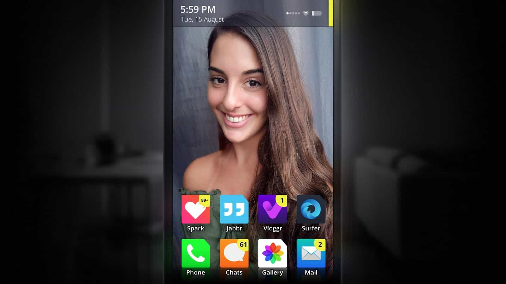
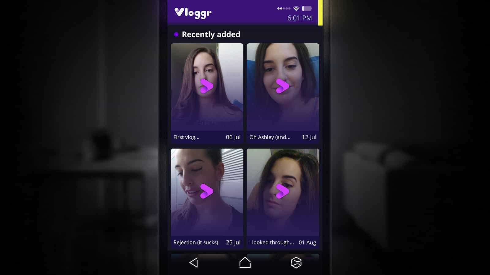
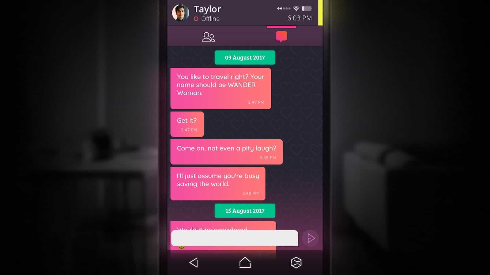
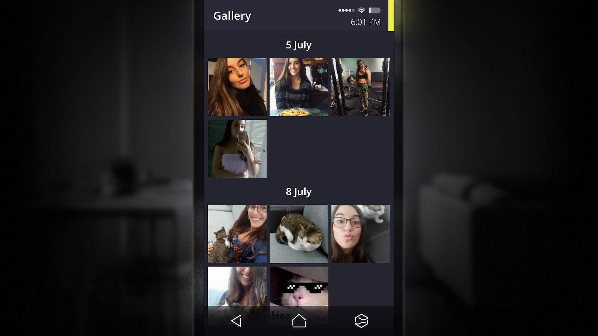

## ขอสั้นๆ บรรทัดเดียว

> " เกมนี้เราจะต้องไขปริศนาการหายตัวของหญิงสาวชื่อ **_แอนนา_** โดยอาศัยเบาะแสผ่านมือถือของเธอที่ตกมาอยู่ในมือเรา "

## มาดูแนวเกมกันหน่อย

ถ้าจะต้องติดแท็กให้เกมนี้สัก 3 อันว่าเป็นเกมแนวไหนผมจะเลือกแบบนี้นะ **"แก้พัซเซิล, เลือกตอบคำถาม, หลอน"** เดี๋ยวเรามาลงรายละเอียดทีละข้อกัน

### แก้พัซเซิล

เราจะเล่นเกมทั้งหมดผ่านจอมือถือของแอนนานี่แหละ คือต้องใช้ข้อมูลจากแอพต่างๆในเครื่องให้เป็นประโยชน์ ไม่ว่าจะเป็นแอพโซเชียล คล้ายๆ Twitter, แอพหาคู่ อันนี้คล้ายๆ Tinder, อีเมล์ และอะไรก็ตามที่พอจะหาได้ในเครื่องเพื่อสืบหาเบาะแส

พัซเซิลก็มีหลายแบบ ตรงนี้อาจจะเล่าได้ไม่เยอะเดี๋ยวสปอยล์ แต่บอกได้ว่าท้าทายพอสมควร อาจจะมีอันที่ง่ายๆ หน่อย เช่น เรียงคำให้เป็นประโยค, ประกอบรูปเพื่อให้ได้รูปภาพที่สมบูรณ์ อะไรทำนองนี้

### เลือกตอบคำถาม

ที่จะดูมีบทบาทเยอะหน่อยก็คือการคุยแชทนี่แหละครับ คือเราต้องคุยแชทเพื่อเก็บข้อมูล โดยการตอบแชทของเราจะเป็นแบบเลือกตอบเหมือนเลือก ก ข ค ง แบบนั้น ซึ่งการตอบก็จะมีผลต่อเนื้อเรื่องนั่นเองครับ

### หลอน?

ที่ใส่ ? เพราะว่าความหลอนส่วนใหญ่มันมาจาก jumpscares นี่แหละ ตุ้งแช่ๆ กันทั้งเรื่อง เรียกว่าชวนตกใจซะมากกว่า ถึงแม้จะไม่ค่อยชอบแต่ก็พอเข้าใจได้เพราะเกมมันเล่นอยู่บนจอมือถือ เลยคิดว่าน่าจะทำให้หลอนด้วยวิธีอื่นได้ยาก (มั้ง?)

## สรุป

ในแง่ของเวลา เกมนี้เป็นเกมสั้นๆ ผมใช้เวลาเล่นไป 5 ชั่วโมงครึ่ง แต่ถ้าอยากเก็บพวก achievement ให้ครบก็ต้องบวกไปอีกหน่อย ผมดูข้อมูลจากเว็บ howlongtobeat เห็นว่าใช้เวลาราว 10 ชั่วโมง

ด้านเนื้อเรื่องผมชอบนะ ยิ่งเล่นยิ่งอยากรู้ว่ามันเกิดอะไรขึ้น รวมไปถึงการที่ผมเล่นรวดเดียวจบ เลยสรุปเอาว่าเนื้อเรื่องของเกมนี้น่าติดตามละกัน

ด้านภาษา ถึงแม้ว่าตัวเกมจะต้องมีคุยแชทกับคนนั้นคนนี้ แถมยังต้องเลือกตอบคำถามอีก แต่ภาษาอังกฤษในเกมถือว่าอ่านง่ายครับ เป็นภาษาพูดคุยธรรมดาที่แสลงไม่เยอะ เรียกว่าเอาดิกชันนารีพับเก็บไปได้เลย

ด้านราคาเนี่ยผมซื้อมาในราคาเต็ม 99 บาทเองครับ แต่ก็เห็นมีลดราคาอยู่บ้างที่ราวๆ 50% ครับ ดังนั้นถ้าเอาราคามาคิดกับคุณภาพเกมแล้วผมว่าคุ้มมากเลยนะ
