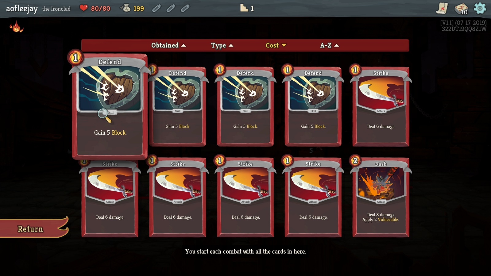
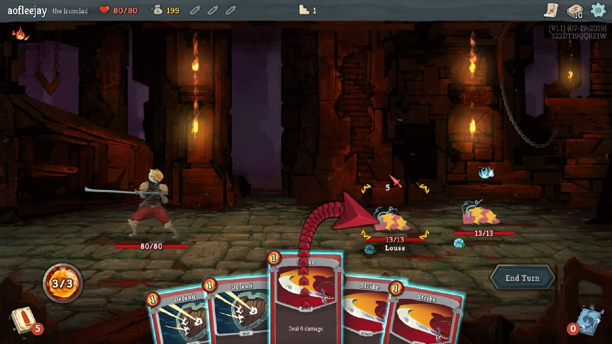
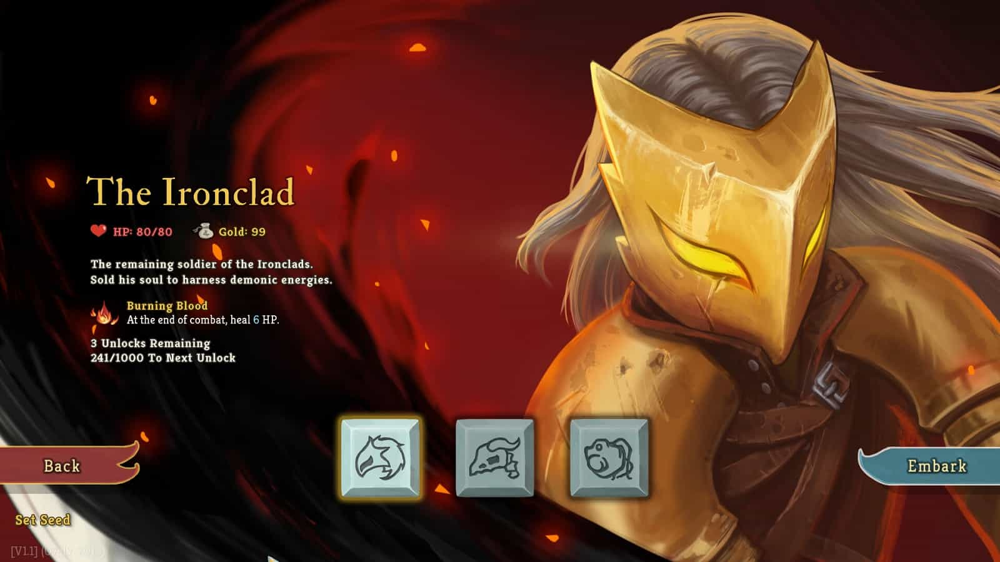
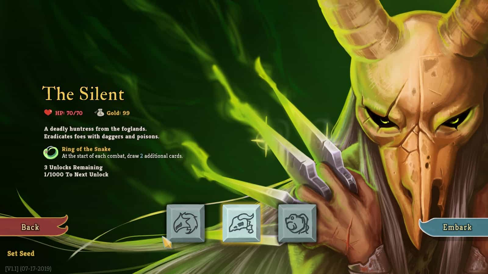
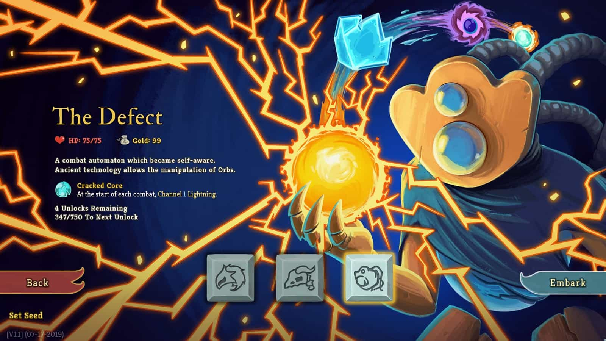
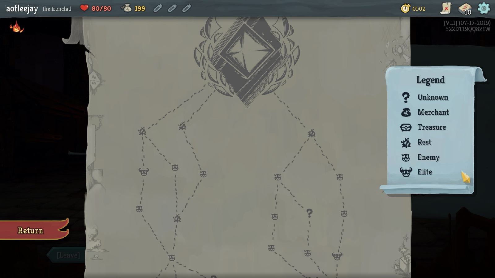
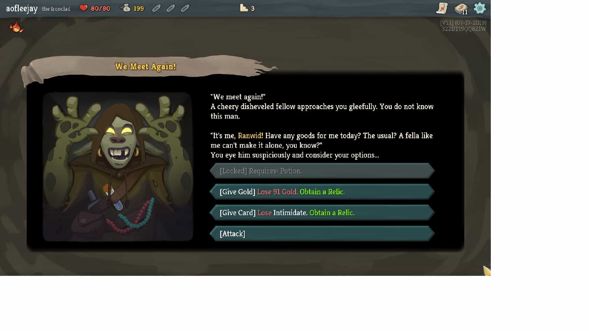
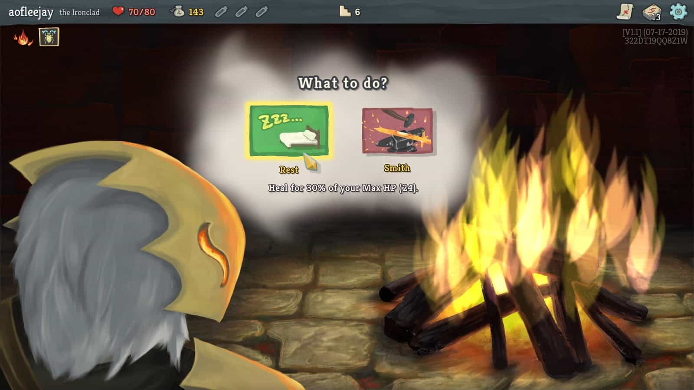
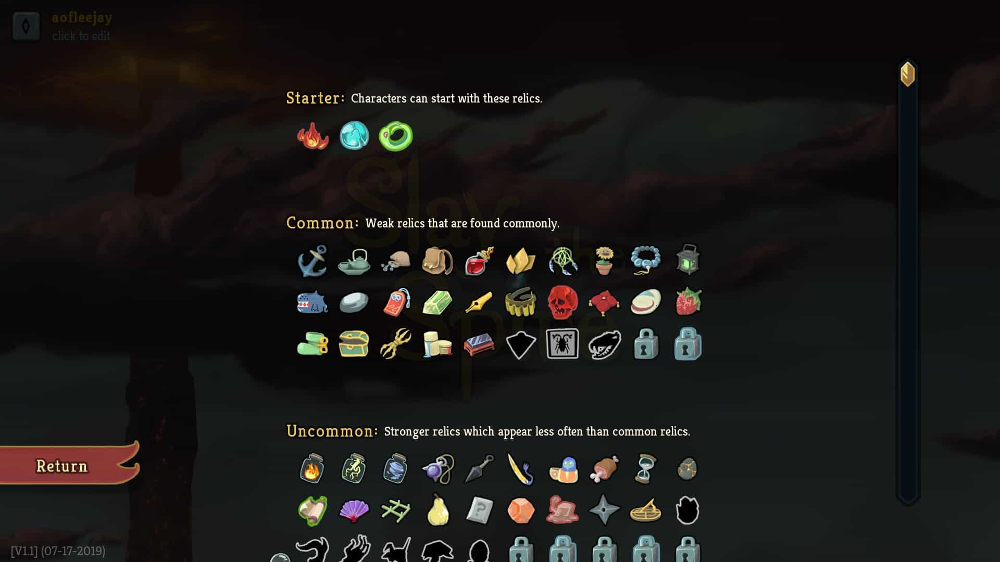

อธิบายง่ายๆ เกมนี้เป็นเกมต่อสู้โดยใช้การ์ด เป้าหมายของเกมคือตะลุยด่านไปเรื่อยๆ และเอาชนะบอสของแผนที่ให้ได้ เมื่อชนะบอสได้ครบสามแผนที่ก็ถือว่าชนะทันที

ด้วยความที่เป็นเกมแนว rogue like ดังนั้น **ถ้าระหว่างทางเราตาย ก็ต้องเริ่มเล่นใหม่ทั้งหมด** และในการเล่นครั้งถัดไป หลายๆอย่างในเกมก็จะถูกสุ่ม ทำให้การเล่นแต่ละครั้งได้รับประสบการณ์ที่ไม่เหมือนเดิม

## เมื่อเป็นเกมการ์ดก็ต้องพูดถึง"การ์ด"

เริ่มเกมก็จะมีการ์ดพื้นฐานให้ 10 ใบ เช่น การ์ดโจมตี, การ์ดเพิ่มเกราะ โดยเราสามารถเพิ่มการ์ดในกองได้ด้วยการเอาชนะศัตรู หรือซื้อเอาจากพ่อค้าก็ได้

นอกจากการหาการ์ดดีๆแล้ว ก็ยังมีการอัพเกรดการ์ดด้วย ทำให้การ์ดเดิมๆใช้งานได้ดีขึ้นไปอีก

## การต่อสู้ด้วยการ์ด

ในการต่อสู้แต่ละเทิร์นเราจะเลือกใช้การ์ดได้ตาม energy ที่เรามี (ในรูปด้านล่างที่เป็น 3/3) ซึ่งตรงมุมซ้ายบนของการ์ดจะระบุไว้ว่าใช้ energy เท่าไหร่

ระหว่างเราเลือกใช้การ์ดอยู่นั้น เราสามารถดูสัญลักษณ์บนหัวของศัตรูได้ว่าเทิร์นนี้มันจะทำอะไร เมื่อเลือกใช้การ์ดเรียบร้อยก็กดจบเทิร์น ก็จะเป็นคิวของศัตรูได้ออกท่าทางครับ จากนั้นก็เล่นสลับกันจนกว่าจะมีใครแพ้

## ตัวละครทั้งสาม

เกมนี้จะมีตัวละครให้เลือกทั้งหมดสามตัว เริ่มต้นจะมีแค่ **The IronClad** จากนั้นจะปลดล็อค **The Silent** และ **The Defect** ได้ทีหลัง แต่ละตัวจะมีความสามารถพิเศษและกองการ์ดที่ไม่เหมือนกัน

## แผนที่ที่คิดแล้วคิดอีกว่าจะเดินยังไง

แผนที่ในเกมก็จะเป็นเส้นทางให้เราเดินไปเรื่อยๆและสิ้นสุดลงที่ต่อสู้กับบอส และมีเหตุการณ์ต่างๆให้เจอระหว่างทาง เช่น เจอพ่อค้า, เจอที่พักที่ต้องเลือกระหว่างพักผ่อนหรืออัพเกรดการ์ด หรือแม้แต่เหตุการณ์สุ่มที่ไม่รู้ว่าจะเจอกับอะไร

## ยาและเครื่องราง

สิ่งที่เพิ่มความแกร่งให้กับเรานอกจากการ์ดแล้ว ยังมียาและเครื่องราง โดยยาจะเป็นแบบใช้ครั้งเดียวแล้วหมดไป เก็บได้สูงสุดสามชิ้น ส่วนเครื่องรางเป็นแบบติดตัวไปตลอดจนจบเกม

ทั้งสองอย่างจะให้ความสามารถพิเศษกับเรา เช่น เริ่มการต่อสู้จั่วการ์ดเพิ่มได้ 2 ใบ, จบเทิร์นที่ 3 โจมตีศัตรูทุกตัว ฯลฯ

## ความเห็นส่วนตัว

เกมนี้ผมเล่นแล้วติดพอสมควรเลยครับ รู้ตัวอีกทีก็ผ่านไปหลายชั่วโมงแล้ว อาจจะเพราะความสนุกที่ได้ผ่านด่านไปเรื่อยๆ บวกกับความที่เกมมันยากระดับนึง ถึงแม้ว่าเล่นแล้วจะตายบ่อยๆแต่ก็ยังเล่นอยู่ เพราะรอบถัดไปก็จะได้เจออะไรที่ไม่เหมือนเดิมก็สนุกดีครับ

ที่ชอบอีกจุดคือการต่อสู้ครับ ปกติเวลาเล่นอะไรที่เป็นการ์ดแล้วผมมักจะนึกถึงดวงก่อนเลย แต่เกมนี้ผมไม่ได้นึกถึงมันเลย แต่สนุกไปกับการคำนวณพลังโจมตี, พลังป้องกัน, การเลือกใช้การ์ด, การใช้ประโยชน์จากเครื่องรางและยา, การเลือกเส้นทางเดินในแผนที่ ถือว่าผมชอบพอตัวเลยครับ

สำหรับใครที่อยากซื้อมาเล่นก็ไปลองกันได้นะครับ ผมเองซื้อมาเล่นใน steam ช่วงลดราคาเหลือ 159.50 บาท จากราคาเต็ม 319 บาท ที่สำคัญหากใครภาษาอังกฤษไม่แข็งแรงก็ไม่เป็นไรนะครับ เกมนี้รองรับภาษาไทยด้วยครับ ยังไงก็ขอให้สนุกกับการเล่นเกมนะครับ สวัสดีครับ
