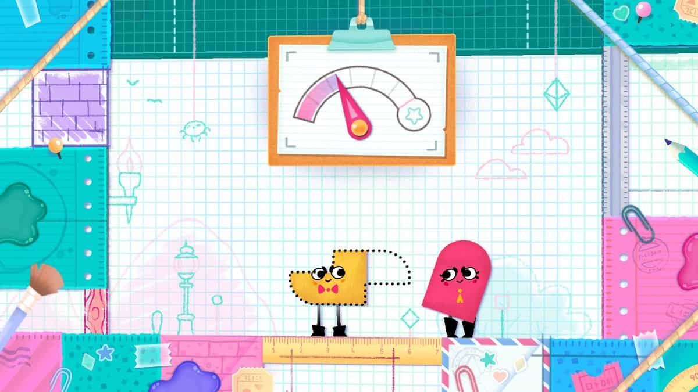
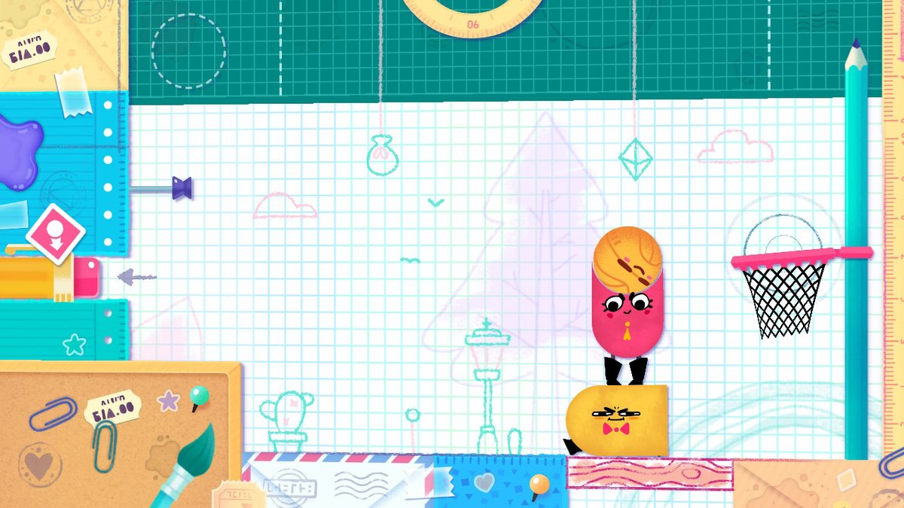

ใครที่สนใจเกมแนวแก้ puzzle บน Nintendo Switch มาเล่นกับเพื่อน ผมว่า <a href="https://www.nintendo.com/games/detail/snipperclips-switch" target="_blank">Snipperclips</a> เป็นอีกเกมที่ไม่ควรพลาดเลยครับ ในเกมนี้เราและเพื่อนๆ จะรับบทเป็นเจ้ากระดาษ (ไอตัวสีแดงสีเหลืองบนรูปหน้าปกน่ะ) ช่วยกันทำภารกิจตะลุยด่านแก้ puzzle ด้วยกันครับ

ตัวเกมก็เล่นไม่ยากครับ เราจะอาศัยความสามารถของตัวละครของเราและเพื่อนคือ สามารถตัดเองกันให้เป็นรูปทรงต่างๆ ได้ หรือบางครั้งก็ต้องหมุนตัวบ้าง ต่อตัวบ้าง เพื่อแก้ปัญหาในแต่ละด่านครับ

ซึ่ง puzzle ในเกมนี้มีเยอะมากๆและสนุกมากๆครับ ยกตัวอย่างเช่น

- ตัดตัวละครให้เป็นรูปทรงตามกำหนด
- เหลาดินสอ
- จับแมลงไปเข้าตาข่าย
- โยนลูกบาสลงห่วง

เผื่อใครนึกภาพไม่ออกดูรูปด้านล่างได้เลยจ้า

ตัวเกมหลักราคา $19.99 และมี DLC เป็น puzzle เพิ่มในราคา$9.99 หรือจะซื้อเป็นบันเดิลทีเดียวเลยก็ได้ราคา \$29.98 (ซื้อคู่ไม่ลดหน่อยหรอ 55)

---

นี่เป็นอีกเกมนึงที่ผมกับเพื่อนเล่นกันแทบทุกวันแบบเพลินๆเลย รู้สึกว่าคุ้มค่ามากๆ ใครอยากหาเกมเล่นกับเพื่อนๆ ผมแนะนำเลยครับ
