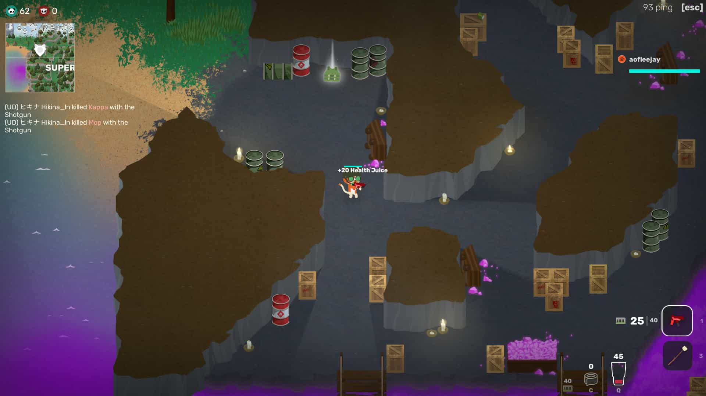
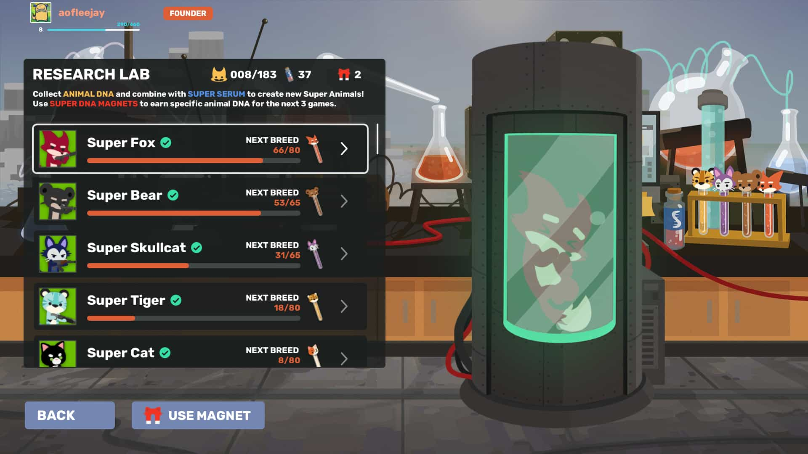
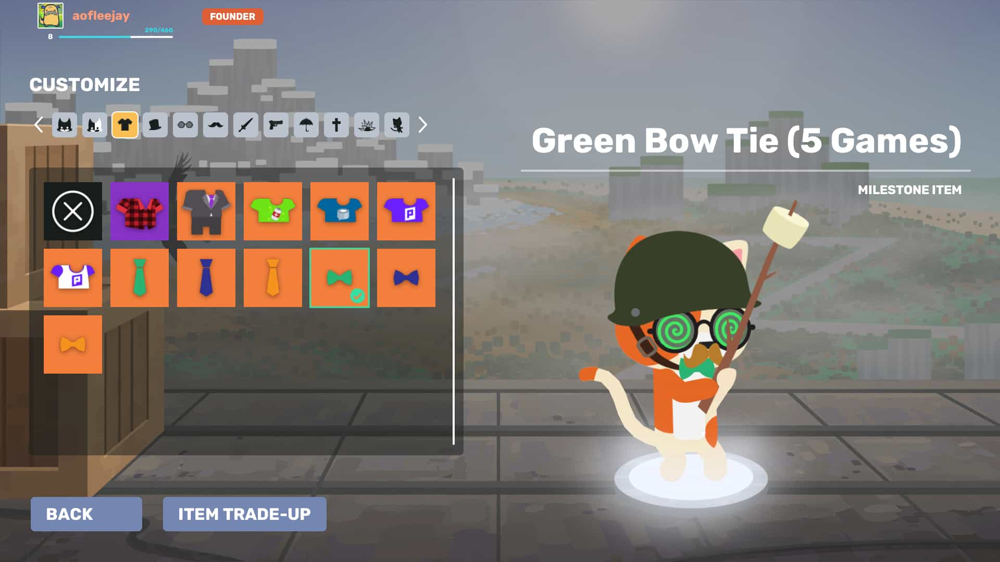
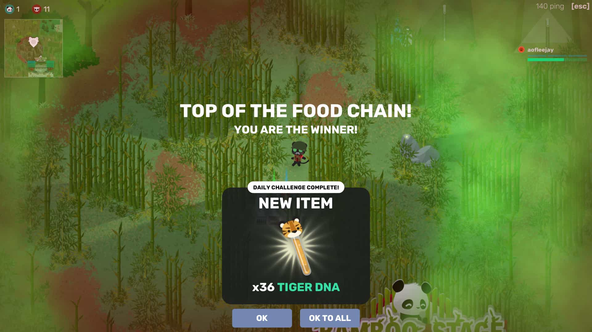

ความที่อยากลองเล่นเกมแนว Battle Royale มานาน บวกกับช่วง Steam Summer Sale ที่ลดราคาเกมกันกระหน่ำเลย เลยคิดว่าต้องเสียตังหาเกมเล่นแล้วแหละ ก็ได้เจอกับ <a href="https://animalroyale.com/" target="_blank">Super Animal Royale</a> เกมนี้ เลยเป็นที่มาของเล่าเกมครั้งนี้ครับ

ด้วยรีวิวแง่บวกสูงถึง 96%, ภาพตัวละครก็น่ารัก แถมมีตัวฟรีให้เล่นอีก (แหม่ อดเสียตังเลย 😅) ก็เลยไม่พูดพร่ำทำเพลงโหลดมาเล่นเลยดีกว่า

# แวะดูวีดีโอกันก่อน

ลองดูเกมเพลย์กันหน่อยนะ (จริง ๆ ผมเล่นไม่เก่งนะ แต่ใครจะเอามาลงล่ะ จริงมั้ย ? 😅)

`youtube:https://www.youtube.com/watch?v=TbvxYCbdTko`

# เกมเพลย์

เกมนี้เป็นเกมแนว Battle Royale ครับ 64 คนสู้กันเพื่ออยู่รอดเพียงคนเดียว คอนเซปก็คล้ายๆกับเกมอื่นๆนะ ไม่ต่างกันมากนัก

แต่ความต่างแรกที่เห็นได้ชัดคือ **ตัวเกมเป็นมุมมองจากด้านบนครับ** แต่ไม่ได้มองเห็นทะลุปรุโปร่งทั้งแมพนะ มุมมองของเราก็ยังถูกสิ่งกีดขวางบดบังได้อยู่ ลองสังเกตแสงเงาในถ้ำของรูปข้างล่างได้ครับ

เกมนี้เก็บปืนได้ 2 กระบอก, อาวุธสั้น 1 ชนิด และระเบิดอีก 1 ชนิดครับ

เรื่องของอาวุธ วันนี้ที่ผมเขียน มีปืนอยู่ 12 ชนิดไม่ว่าจะเป็น **Pistol, Magnum, Silenced Pistol, Deagle, SMG, Shotgun, AK, M16, Sniper** และ **Minigun** แต่ละชนิดลองใช้แล้วเห็นความต่างชัดเจนเลย

ระเบิดก็มีให้ใช้ถึง 3 แบบ คือ **Grenade** (ระเบิดมือ), **Banana** (ระเบิดกล้วย เหยียบแล้วลื่นล้มเอง😂) และ **Skunk Bomb** (ระเบิดควันพิษ) ผมเห็นคนเล่นเก่ง ๆ ใช้นี่ดูมีประโยชน์มากเลย

ไอเท็มสายช่วยเหลือก็มีเกราะเอาไว้เพิ่มความอึด ถ้าพังสามารถใช้เทปกาวซ่อมได้ และก็ยาที่รูปร่างเหมือนแก้วกั๊ฟเซเว่น เอาไว้กินเติมเลือดได้ครับ

เกมนี้มียานพาหนะคือ Hamster Ball เอาไว้กลิ้งได้เร็ว ๆ เผื่อต้องเดินทางไกล แถมชนคนอื่นร่วงได้ด้วยนะเออ

ซึ่งทุกครั้งที่จบเกมก็อาจจะดรอปชุดหรือลายปืนสวยๆ เอาไว้อวดเพื่อนได้ด้วย (ไม่มีผลต่อความเก่งในเกมนะจ๊ะ)

# เกี่ยวกับตัวเกม

ตัวเกม ณ วันที่ผมเขียนยังเป็น Early Access อยู่นะครับ แต่ฟีจเจอร์หลัก ๆ ก็มาครบแล้วแหละ

ถ้าใครอยากลองโหลดมาเล่น ตัวเกมมีอยู่ 3 แบบครับ

- **Super Animal Royale: Super Free Edition** ตัวเกมแบบฟรี เล่นได้เหมือนตัวเสียตังเลย ดรอปไอเท็มได้ แค่ใส่ไม่ได้
- **Super Animal Royale** ตัวนี้เป็นตัวมาตรฐาน สามารถใส่ชุด ใส่ปืนสวย ๆ ได้แล้ว
- **Super Animal Royale: Founder's Edition** มีตัวละครเพิ่มให้ 3 แบบ, ไอเท็มตกแต่งอีก 10 แบบ, ชื่อตัวละครเป็นสี และแถม soundtrack ให้ด้วย (สุดท้ายผมโดนอันนี้ล่ะ เสียตังอยู่ดี 🤣)

โดยของทั้งหมดที่ได้มาในเวอร์ชันฟรี เมื่อซื้อเกมเต็มแล้วก็จะเข้าเกมเต็มให้เลย ไม่ต้องหาใหม่นะ

## ตัวละคร

ตัวละครเริ่มแรกที่เกมให้มามี 4 ตัว คือ จิ้งจอก, แมว, เสือ และหมี แต่ตัวอื่น ๆ เราสามารถปลดล็อคได้อีกภายหลังครับ

ถ้าเราเล่นจบแต่ละตาจะได้ DNA มา ก็จะเอาไปแลกเป็นตัวละครได้ เท่าที่เห็นมีเป็นร้อยตัวเลย 😲 เยอะมาก ๆ และบอกเลยแต่ละตัวน่ารักมากครับ

## ไอเท็มตกแต่ง

ชุดหรือสกินปืนจะสุ่มดรอปให้หลังจากเราเล่นเกมจบหนึ่งตาครับ แต่คนที่มีตัวเกมแบบ Super Free Edition จะยังใส่ไม่ได้ ต้องซื้อตัวเต็มมาก่อนนะ

## โหมดการเล่น

ตอนนี้เกมแบ่งออกเป็นสามโหมดคือ Solo, Duo, Squad ณ วันที่เขียนโหมด Squad ยังปิดอยู่ (แต่ผมเคยเห็นรีวิวของฝรั่งมีเล่น Squad กันอยู่นะ)

## เซิฟเวอร์

ตอนนี้มีอยู่ 3 เซิร์ฟ ใกล้สุดตอนนี้อยู่ที่ออสเตรเลีย ปิงราว ๆ 90ms ครับ เล่นได้ไม่มีปัญหาเลย

---

# เล่าจบละ

รวม ๆ ผมชอบเกมนี้มากนะ ทำภาพออกมาได้น่ารักมาก 🤗, มีตัวละคร / ชุดให้ปลดล็อคเยอะมาก ได้ชุดนั้นก็อยากได้ชุดนี้อีก 😆

อีกอย่างที่ชอบมากคือเกมนึงใช้เวลาราว ๆ 5 นาทีเอง ผมว่ากำลังดีเลย ไม่ล้าจนเกินไป

ข้อเสียที่พอจะนึกออกคือคนมันยังไม่ได้เยอะมากนะ ผมเล่นตอนดึก ๆ จะเห็นเลยว่าคนมันไม่ครบ 64 คน แล้วเกมก็จะเอาบอทมาใส่แทน (สังเกตช่วงท้าย ๆ ก่อนเข้าเกม ถ้าคนน้อย จู่ ๆ จะมีคนเข้ามาจากไหนไม่รู้จนครบ 64 คนเลย)

วันนี้ก็มาเล่าเกมเท่านี้ เจอกันใหม่บทความหน้านะครับ
