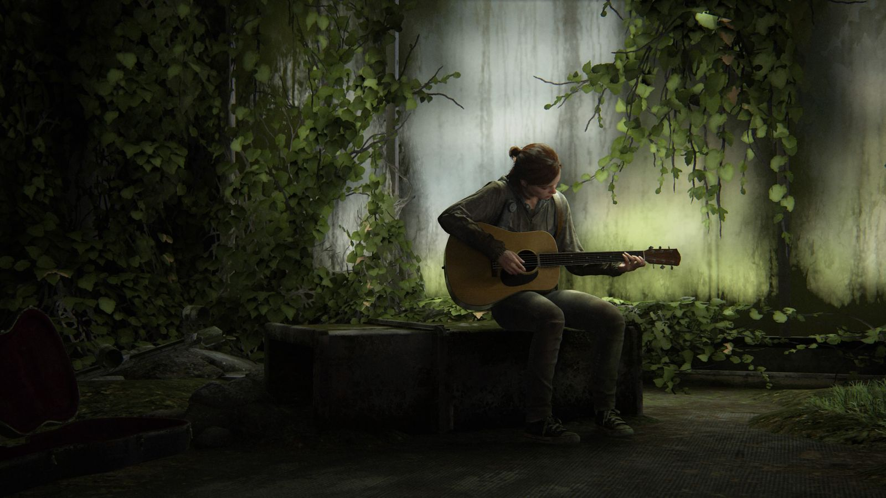
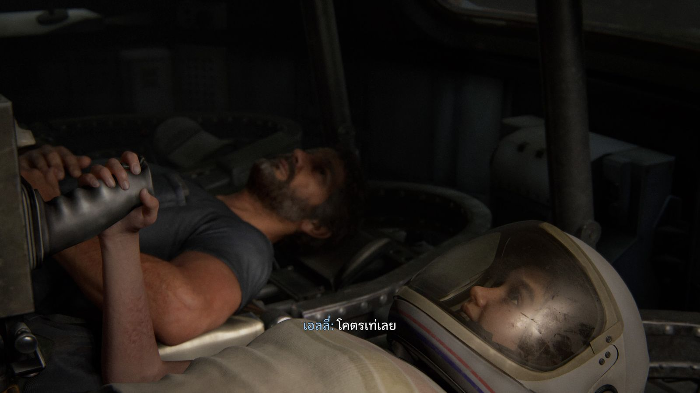
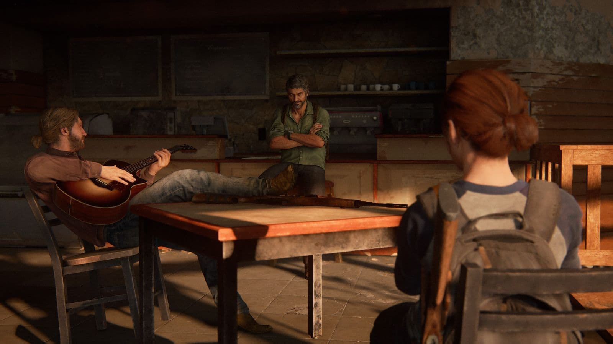
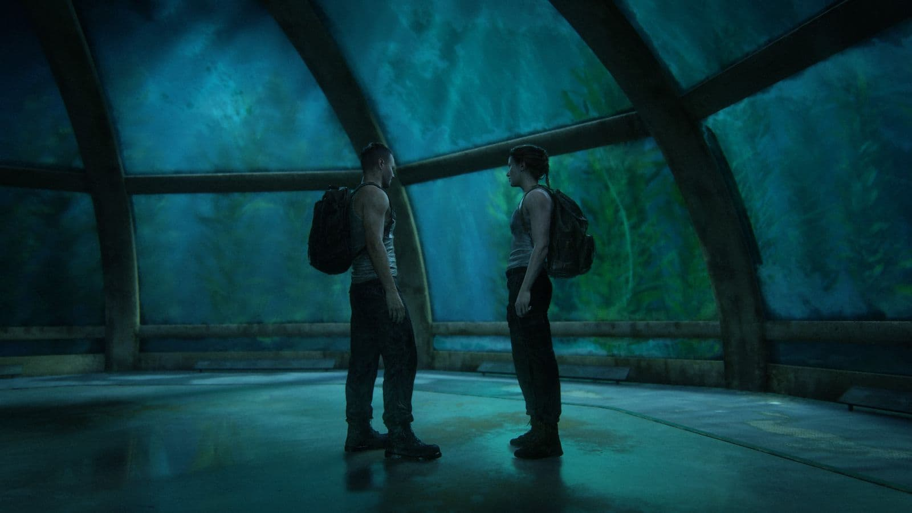
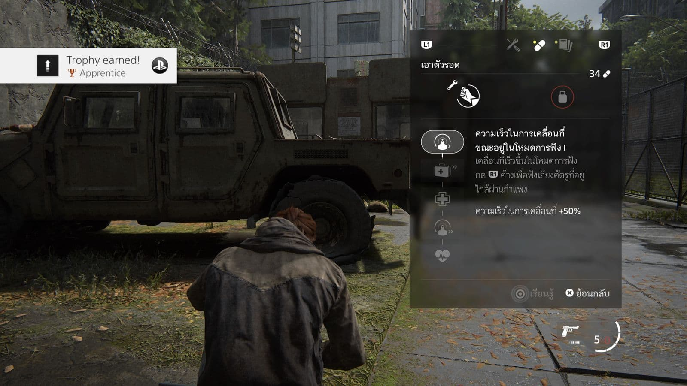
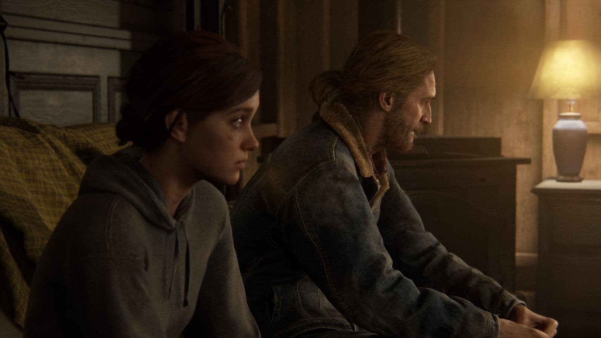
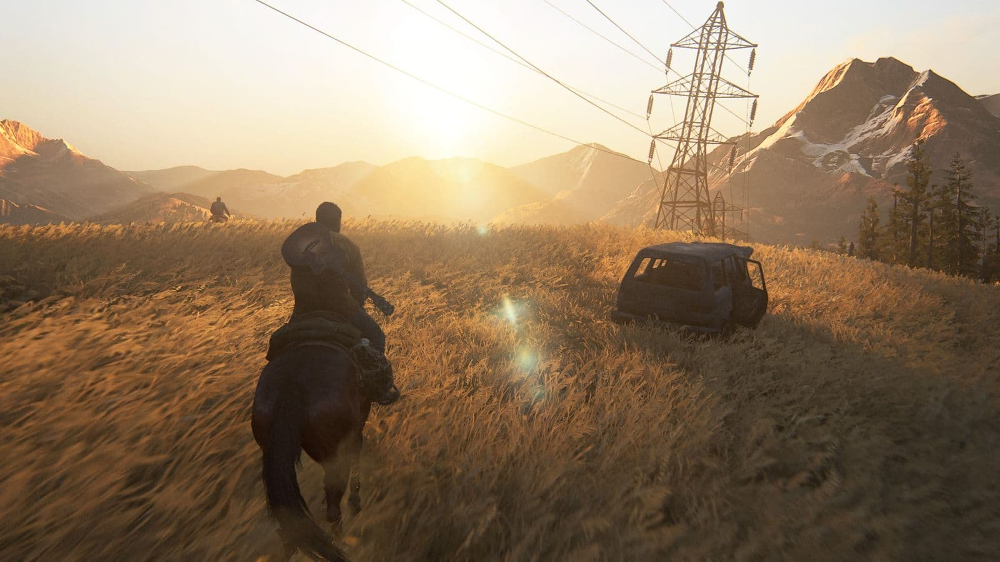

สรุปเกม The Last of Us Part II เรื่องราวสี่ปีต่อจากภาคที่แล้ว เนื้อเรื่องทั้งหมดเป็นอย่างไร? เกมเพลย์มีอะไรน่าสนใจบ้าง? สรุปมาให้แล้วที่นี่ครับ

> บทความนี้มีการเปิดเผยเนื้อเรื่องนะครับ

> เนื่องจากในเกมจะเล่าเรื่องอดีตและปัจจุบันสลับไปมา เลยขอเล่าเนื้อเรื่องตามลำดับเวลาตั้งแต่ภาคที่แล้ว เพื่อความเข้าใจง่ายนะครับ

---

---

## เนื้อเรื่อง

### โรงพยาบาลเซนต์แมรี่

โจเอลได้พาเอลลี่ไปที่โรงพยาบาลของกลุ่มไฟเออร์ฟลาย แต่ได้รู้ความจริงว่าการผลิตวัคซีนได้นั้นเอลลี่ต้องตาย โจเอลจึงบุกชิงตัวเอลลี่ออกมา และฆ่าคนของไฟเออร์ฟลายตายไปหลายคน

หนึ่งในคนที่ถูกโจเอลฆ่าคือหมอผ่าตัด ทำให้**แอ็บบี้**ลูกสาวของหมอแค้นใจอย่างมาก จึงออกตามล่าโจเอลในเวลาต่อมา

### แจ็คสัน

หลังจากเหตุการณ์ภาคแรกสี่ปี โจเอลและเอลลี่ตั้งหลักอยู่ที่แจ็คสัน พร้อมกับตัวละครสำคัญๆ ทั้งเก่าและใหม่

- **ดีน่า** แฟนของเอลลี่
- **เจสซี่** เพื่อนของเอลลี่ เป็นแฟนเก่าของดีน่า
- **ทอมมี่** น้องชายของโจเอล

วันหนึ่งโจเอลและทอมมี่ออกลาดตระเวน และได้เจอกับแอ็บบี้กำลังถูกผู้ติดเชื้อเล่นงานอยู่ ทั้งสามพากันเอาตัวรอดหนีไปยังกลุ่มของแอ็บบี้อย่างปลอดภัย

สุดท้ายแอ็บบี้ที่ตามหาโจเอลมานานก็ยิงปืนเข้าที่ขาและทรมานโจเอลจนเสียชีวิต ถึงแม้เอลลี่จะตามมาจนเจอ แต่ก็ช่วยอะไรไม่ได้ ได้แต่เก็บความแค้นไว้ ส่วนฝั่งแอ็บบี้หมดเรื่องกับโจเอลแล้วจึงจากไป และไว้ชีวิตทอมมี่และเอลลี่

เสริมส่วนของแอ็บบี้คือ ตอนนี้แอ็บบี้เข้าร่วมกับกลุ่มใหม่ชื่อว่า **WLF** มีสมาชิกหลายพันคน ส่วนกลุ่มย่อยที่ออกมาเจอกับโจเอล มากันราว 7-8 คน มีคนสำคัญๆ ดังนี้

- **โอเว่น** แฟนเก่าแอ็บบี้ตั้งแต่อยู่ไฟเออร์ฟลาย จนเข้าร่วมกับ WLF และเพิ่งเลิกกันได้ไม่กี่ปี
- **เมล** เป็นหมอและแฟนใหม่โอเว่น
- **นอร่า** เพื่อนแอ็บบี้และเป็นอดีตไฟเออร์ฟลาย
- **แมนนี่** เพื่อนแอ็บบี้

หลังจากเอลลี่กลับมายังแจ็คสันก็เตรียมตัวออกไปล้างแค้น โดยมีทอมมี่ออกไปก่อนเป็นคนแรกโดยไม่บอกใคร ส่วนเอลลี่เดินทางไปกับดีน่า และเจสซี่ออกไปเป็นคนสุดท้าย

### ซีแอตเทิล วันที่ 1 (เอลลี่)

เอลลี่ออกเดินทางไปพร้อมดีน่า เป้าหมายคือหาตัวแอ็บบี้และตามหาทอมมี่ที่ออกมาก่อน

ระหว่างทางจะได้รู้เรื่องราวของกลุ่ม WLF ที่ปัจจุบันมีเรื่องกันกับกลุ่มบ้าลัทธิชื่อ**เซราไฟต์**

เอลลี่จะทราบต่อว่าสมาชิกคนหนึ่งในกลุ่มของแอ็บบี้อยู่ที่สถานีโทรทัศน์ เมื่อเข้าไปจึงพบว่าทั้งหมดตายหมดแล้ว ด้วยฝืมือของกลุ่มเซราไฟต์ เอลลี่และดีน่าจึงกลับไปพักที่โรงละครแห่งหนึ่ง

เอลลี่จะเห็นว่าดีน่ามีอาการเหนื่อยล้ากว่าปกติ จนดีน่าบอกความจริงว่าเธอท้องกับเจสซี่

### ซีแอตเทิล วันที่ 2 (เอลลี่)

เอลลี่และดีน่าได้เบาะแสว่ามีการปะทะกันที่ฮิลเครสท์ระหว่าง WLF และชายแปลกหน้าคนหนึ่ง ซึ่งคิดว่าเป็นทอมมี่ แต่ด้วยอาการแพ้ท้องของดีน่า เอลลี่เลยให้ดีน่าพักผ่อนและออกเดินทางเพียงคนเดียว

ระหว่างเดินทางจะต้องผ่านพวก WLF เยอะมากและจะได้เจอกับชายที่ว่า แต่ไม่ใช่ทอมมี่ ที่จริงคือเจสซี่ที่ตามมาช่วยทีหลัง เมื่อหนีตายกันมาได้ก็เดินทางกลับที่พักไปหาดีน่าที่โรงละครต่อไป

คราวนี้ดีน่าจะได้เบาะแสว่านอร่าหนึ่งในกลุ่มของแอ็บบี้อยู่ที่โรงพยาบาล เอลลี่จึงออกเดินทางไปตามหานอร่าเพียงคนเดียว

ระหว่างทางจะเต็มไปด้วยผู้ติดเชื้อ และก็ต้องฝ่ากลุ่มเซราไฟต์กลุ่มใหญ่ จนถึงโรงพยาบาลที่พวก WLF อยู่ เอลลี่จะจัดการทั้งหมดและเข้าไปรีดความลับกับนอร่าว่าแอ็บบี้อยู่ที่อควาเรียม จากนั้นเอลลี่จึงกลับมายังโรงละคร

### ซีแอตเทิล วันที่ 3 (เอลลี่)

ครั้งนี้เอลลี่จะออกเดินทางไปกับเจสซี่เพื่อไปหาแอ็บบี้ที่อควาเรียม ระหว่างทางทั้งสองจะเห็นไม่ตรงกันคือเจสซี่จะไปช่วยทอมมี่ส่วนเอลลี่อยากไปตามแอ็บบี้ จึงแยกทางกันไป

ระหว่างทางจะเจอกับพายุเข้า เมื่อเอลลี่ฝ่าไปจนถึงอควาเรียมจะเจอแค่โอเว่นกับเมล สุดท้ายมีการขัดขืนกันจนเอลลี่ฆ่าทั้งคู่ตาย และพอดูที่ศพของเมลจะเห็นว่าเมลท้อง เอลลี่เลยช็อคมาก จนเจสซี่และทอมมี่ตามมาสมทบและพากลับไปยังโรงละคร

พอกลับไปยังโรงละครทุกคนก็ตัดสินใจจะกลับหมู่บ้าน แต่ระหว่างนั้นแอ็บบี้ก็บุกมายิงใส่ทอมมี่และฆ่าเจสซี่ตาย จากนั้นเกมก็จะตัดให้เราไปเล่นเนื้อเรื่องฝั่งแอ็บบี้ต่อไป

### ซีแอตเทิล วันที่ 1 (แอ็บบี้)

ฝั่งแอ็บบี้จะเริ่มที่ฐานของ WLF ที่ตั้งอยู่ในสนามกีฬา มียิม มีปศุสัตว์ มีการจัดการอย่างเป็นระบบ

แอ็บบี้จะโดนเรียกตัวไปแนวหน้าพร้อมกับแมนนี่และเมล ระหว่างทางก็จะปะทะกันกับกลุ่มเซราไฟต์ สุดท้ายจะได้กองกำลังมาช่วยจนรอดไปได้

แต่กลับมาที่ฐานจะพบว่าโอเว่นหายตัวไป แอ็บบี้รู้ว่าโอเว่นจะต้องอยู่ที่อควาเรียม เลยแอบออกจากฐานไปหาโอเว่นตามลำพัง

แต่ระหว่างทางแอ็บบี้จะถูกเซราไฟต์จับตัวไปได้ และเซราไฟต์ก็ยังจับ**ยาร่า** เด็กหญิงชาวเซราไฟต์ที่เป็นกบฎมาด้วยเช่นกัน

ยาร่าโดนค้อนทุบเข้าที่แขน แต่สุดท้ายจะรอดมาได้ด้วยการช่วยเหลือของ**เลฟ** น้องชายของยาร่า และพากันหนีออกจากพวกเซราไฟต์จนได้

ออกมาแล้วแอ็บบี้แยกทางกันกับเด็กๆ และไปเจอโอเว่น แอ็บบี้นึกถึงเด็กๆเลยตัดสินใจออกจากอควาเรียม กลับมาช่วยเด็กๆ

### ซีแอตเทิล วันที่ 2 (แอ็บบี้)

แอ็บบี้กลับมาช่วยเด็กๆทั้งสองและพากลับไปที่อควาเรียม ยาร่าต้องตัดแขนแต่เมลไม่มีอุปกรณ์ เลฟเลยพาแอ็บบี้ไปหาของที่โรงพยาบาลผ่านสะพานลอยฟ้าที่เซราไฟต์สร้างไว้

ตามเส้นทางจะเจอพวกเซราไฟต์และจะได้รู้ชื่อจริงของเลฟว่าชื่อลิลลี่ สาเหตุที่เลฟเป็นกบฎเพราะที่จริงเลฟเป็นผู้หญิงแต่ไปโกนหัวเหมือนผู้ชาย ซึ่งผิดธรรมเนียมของเซราไฟต์ เลยหนีมากับยาร่า และถูกตามล่ามาเรื่อยๆ

ทั้งคู่จะเดินทางไปหาเครื่องมือผ่าตัดมาจนได้ และช่วยผ่าตัดให้ยาร่าได้สำเร็จ

### ซีแอตเทิล วันที่ 3 (แอ็บบี้)

โอเว่นจะชวนเด็กๆไปยังซานตาบาร์บาร่า ที่ที่เชื่อกันว่ากลุ่มไฟเออร์ฟลายไปรวมตัวกันที่นั่น แต่ยาร่ากับเลฟทะเลาะกันเพราะเลฟอยากพาแม่ไปด้วย แต่ยาร่าเชื่อว่าแม่คลั่งลัทธิเซราไฟต์ ถ้าเลฟไปคงโดนจับแน่นอน

สุดท้ายเลฟแอบขึ้นเรือหนีไปตามแม่ที่เกาะของเซราไฟต์ แอ็บบี้กับยาร่าเลยตัดสินใจไปตามเลฟกลับมา

เมื่อไปยังเกาะจะเจอว่าพวก WLF กำลังบุกเข้าโจมตีเกาะของเซราไฟต์พอดี ทั้งคู่ฝ่าการต่อสู้ไปจนเจอเลฟ

เลฟพยายามเปลี่ยนใจแม่ แต่สุดท้ายแม่ของเลฟล้มกระแทกโต๊ะจนเสียชีวิต แอ็บบี้และยาร่าเลยพาเลฟหนีออกจากเกาะ ยาร่าจะเสียชีวิตเพราะโดนยิง เหลือแค่เลฟกับแอ็บบี้ที่รอดมายังอควาเรียม

แต่พอกลับมาถึงก็เจอศพของโอเว่นและเมลที่ตายด้วยมือของเอลลี่ แอ็บบี้กับเลฟเลยตามหาเอลลี่จากแผนที่ที่เอลลี่ทำตกไว้

แอ็บบี้ตามเอลลี่มาจนถึงโรงละคร จากนั้นมีการปะทะกัน ทอมมี่โดนยิง เจสซี่ตาย ดีน่าพุ่งเข้าใส่แอ็บบี้ แต่แอ็บบี้พลิกกลับมาเอามีดจ่อคอดีน่า สุดท้ายเลฟห้ามไว้ แอ็บบี้เลยหยุดและออกจากโรงละครกลับไป

### ซานตาบาร์บารา

เวลาผ่านไปแอ็บบี้และเลฟเดินทางไปถึงซานตาบาร์บาร่า แต่กลับเจอพวกกลุ่ม**แรทเลอร์**จับตัวเอาไว้

ด้านเอลลี่ออกจากแจ็คสันมาอยู่ในฟาร์มกับดีน่าและเจเจลูกชาย เอลลี่ยังมีภาพหลอนของโจเอลฝั่งใจอยู่

วันหนึ่งทอมมี่ออกมาเยี่ยม เล่าว่ารู้เบาะแสของแอ็บบี้ว่าอยู่ที่ไหน เอลลี่เลยเดินทางไปยังซานตาบาร์บาร่า

เอลลี่ปะทะกับกลุ่มแรทเลอร์ และตามหาแอ็บบี้และเลฟที่อยู่ในสภาพย่ำแย่จนเจอ ทั้งหมดเตรียมขึ้นเรือเพื่อหนีจากพวกแรทเลอร์

แต่เอลลี่บังคับให้แอ็บบี้ต้องสู้ ถึงแอ็บบี้จะไม่สู้ แต่เอลลี่ก็จ่อมีดไปที่เลฟจนสุดท้ายต้องสู้กัน

ทั้งคู่สู้กันอย่างรุนแรง แอ็บบี้ได้แผลจากมีดและเอลลี่เสียนิ้วมือไปสองนิ้ว เอลลี่จับแอ็บบี้กดน้ำ แต่สุดท้ายเปลี่ยนใจไม่ฆ่าแอ็บบี้และปล่อยให้แอ็บบี้พาเลฟหนีไป เป็นอันจบเนื้อเรื่องของเกมนี้

---

## เกมเพลย์

เราจะได้เล่นเป็นเอลลี่และแอ็บบี้คนละครึ่งๆ ทั้งคู่มีอาวุธและสกิลแยกกันเป็นของตัวเอง

โดยอาวุธสามารถหาได้จากการสำรวจจุดต่างๆ และสกิลก็จะได้ผ่านหนังสือจากจุดต่างๆเช่นกัน

ศัตรูประเภทผู้ติดเชื้อจะมีเพิ่มมาจากภาคที่แล้วอีกสองชนิด

- **รันเนอร์** - มองเห็นปกติ
- **คลิกเกอร์** - ตาบอด แต่ได้ยินเสียงง่ายมาก
- **สตอล์กเกอร์ (ใหม่)** - ชอบซ่อนตัว ดักโจมตีเป็นกลุ่ม
- **แชมเบลอร์ (ใหม่)** - ตัวระเบิดพิษได้ ตายแล้วก็ระเบิดพิษอีก
- **โบลตเตอร์** - ตายยาก ปาพิษได้

ส่วนศัตรูประเภทคนจะมีการพูดคุยกัน เช็คตำแหน่งกัน จะตื่นตัวกันเวลามีเหตุการณ์แปลกๆ เช่น เรียกกันเองแล้วไม่มีใครตอบ หรือคุยๆกันแล้วมีฝั่งนึงเงียบไป ดังนั้นการลอบฆ่าต้องระวัง

ภาคนี้ศัตรูจะมีสุนัขด้วย ซึ่งสามารถตามกลิ่นเราได้ ทำให้เราอยู่กับที่ไม่ได้นาน

เกมนี้มีบรรยายไทยด้วยนะครับ

---

## งานภาพ

นี่คือภาพบางส่วนจากในเกมครับ

---

## สรุปแบบไม่สรุป :)

สุดท้ายก็พยายามเล่าให้ละเอียดที่สุดเพื่อให้ผู้อ่านได้ตัดสินใจเองแล้วกันนะว่ามันดีหรือไม่ดี ใครที่อยากได้อารมณ์แบบเต็มที่ก็ลองไปซื้อมาเล่นแล้วมาพูดคุยกันได้นะครับ ไว้เจอกันใหม่เกมหน้าครับผม
