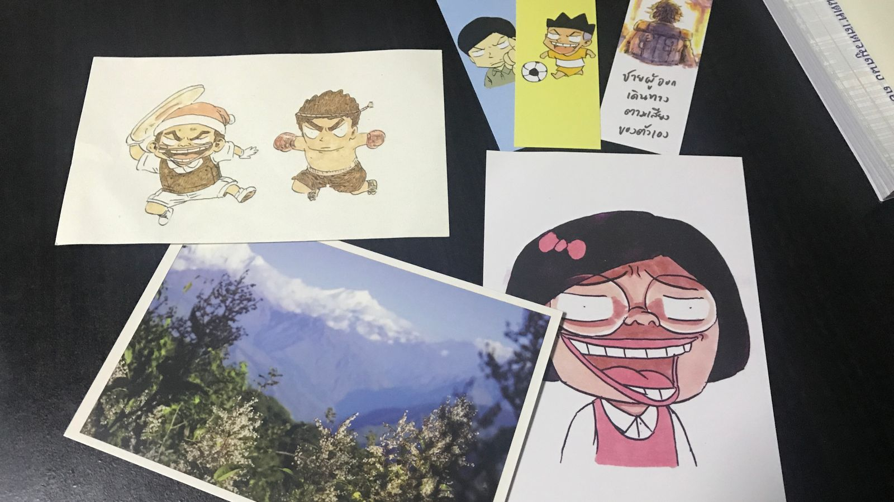

การ์ตูนสะท้อนการศึกษาไทย เล่าถึงเด็กชายคนนึงที่มีความฝันอยากเป็นนักเขียนการ์ตูน มาดูกันว่าเส้นทางของเขาในระบบการศึกษาบ้านเราตั้งแต่ประถมจนถึงมหาวิทยาลัยจะเป็นอย่างไร?

---

ผู้แต่งเล่าถึงการเรียนในวัยประถมที่กลัวการโดนลงโทษจากกฎระเบียบอันพิศดารของโรงเรียน, การเรียนพิเศษเพื่อผลการเรียนที่ดีขึ้น รวมไปถึงระบบที่เน้นการสอนให้นักเรียนคิดและทำเหมือนๆกัน ราวกับมีตัวอย่างนักเรียนที่ดีในอุดมคติ เปรียบได้เป็น **"นักเรียนกระป๋อง"** ที่ถูกผลิตจากสายพานของการศึกษาเข้าสู่ระบบอุตสาหกรรมต่อไป

แต่มีสิ่งหนึ่งที่ช่วยให้ผู้แต่งก้าวข้ามวันเหล่านั้นมาได้คือการวาดการ์ตูน และยังเล่าถึงตลอดการเรียนวิชาศิลปะที่เน้นการวาดให้"ถูกต้อง"เป็นหลัก ทั้งๆที่ภาพวาดดังๆ หลายครั้งก็มีชื่อเสียงได้จากความไม่สมบูรณ์แบบของมัน

ในช่วงมหาวิทยาลัยผู้แต่งได้ศึกษาในคณะสื่อสารมวลชน เรียนแบบเอาตัวรอดจดได้เจอกับวิชาเขียนข่าว ที่ความรู้ในห้องเกิดจากการแลกเปลี่ยนกัน ก่อให้เกิดการแตกยอดสู่ความรู้ใหม่ๆมากขึ้น

ช่วงท้ายของการศึกษา ผู้แต่งที่ได้มีโอกาสทำข่าวเกี่ยวกับค่าแรงที่ต่ำกว่ากฎหมายของยามในมหาลัย ที่กลายมาเป็นประเด็นสำคัญในมหาลัยอีกด้วย

---

ปล. ผมซื้อหนังสือเล่มนี้ผ่าน shopee มาในราคา 270 บาท ด้านล่างเป็นของแถมครับ

