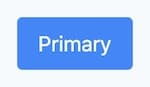

> สวัสดีครับ 👋
>
> นี่เป็นบทความฝั่งโปรแกรมมิ่งบทความแรก ที่ย้ายจาก <a href="https://medium.com/@aofleejay" target="_blank">medium</a> มาเขียนในเว็บนี้ บทความถัดๆ ไปจากนี้ก็คงย้ายมาเขียนที่นี่เช่นกัน ถ้ามีฟีดแบคอะไรบอกกันได้เลยนะครับ 😀

---

บทความนี้เกิดขึ้นมาได้เพราะเมื่อไม่นานมานี้ได้แก้เว็บ เปลี่ยนไปใช้ <a href="https://tailwindcss.com/" target="_blank">Tailwind CSS</a> แล้วก็รู้สึกว่า เออ มันมีอะไรน่าสนใจเยอะเลยแฮะ ก็เลยขอเขียนบล็อกเก็บไว้สักหน่อย

## ทำความรู้จัก Tailwind CSS กันก่อน

เล่าสั้นๆ เกี่ยวกับ Tailwind คือ CSS framework ที่เป็น **utility-first** ว่าง่ายๆ คือแทนที่จะมีคลาสระดับคอมโพเนนต์ให้ใช้อย่าง **class="btn btn-primary"** เหมือนใน Bootstrap แต่กลับให้คลาสเล็กๆ แล้วค่อยเอามาประกอบรวมกัน อย่างเช่น **class="bg-blue-500 text-white px-4 py-2 rounded"** คือเล็กประมาณหนึ่งคลาสหนึ่งหน้าที่เลย

เรามาลองดูคลาสด้านบนกันดีกว่า ว่าแต่ละคลาสมันทำอะไรบ้าง?

- **bg-blue-500** คือแบคกราวน์สีน้ำเงินปกติ ไล่เฉดสีตั้งแต่ 100 คือสีอ่อน จนถึง 900 เป็นสีเข้ม
- **text-white** ก็ color: white; ตรงๆ แหละ
- **px-4** คือ padding ในแกนนอน 1rem (ไม่ได้มีทุกเลขนะ แต่มีสเกลให้ แบบ 0, 1, 2, 3 ... 48, 56, 64 ช่วงท้ายๆ เลขจะห่างขึ้นเรื่อยๆ)
- **py-2** คือ padding ในแกนตั้ง 0.5rem (ตรง py-xx โดย xx มีค่าเท่าไหร่ จับหาร 4 ก็จะได้ตัวเลขในหน่วย rem)
- **rounded** คือ border-radius นั่นเอง

สุดท้ายก็จะได้ผลลัพธ์แบบนี้ครับ



ปล.1 รายละเอียดการติดตั้งหรือการใช้งานก็ไปดูกันได้ที่เว็บหลักเลย <a href="https://tailwindcss.com/" target="_blank">https://tailwindcss.com</a>

ปล.2 ใครอยากทดลองเล่น มีคนทำเพลยกราวไว้ให้แล้วที่นี่ <a href="https://tailwind.run/" target="_blank">https://tailwind.run</a> (เอ้ากราบ 🙏🏻)

ปล.3 ใคร map CSS property มาหาคลาสของ Tailwind ไม่ถูก แบบไม่รู้ว่า text-align: center; คือคลาสอะไรใน Tailwind ก็มีคนทำตัวช่วยไว้ให้แล้วที่นี่ <a href="https://tailwind.spacet.me/" target="_blank">https://tailwind.spacet.me</a> (เอ้ากราบอีกที 🙏🏻)

---

> ต่อไปเป็นสิ่งที่ผมเจอระหว่างการใช้งานแจ้ 😎

## มาพร้อม Base Style

อันแรกที่ชอบคือมันเป็น CSS framework ที่มาพร้อม style พื้นฐานที่มีให้ตั้งแต่ color palette, spacing, shadow ฯลฯ เตรียมไว้ให้เสร็จสรรพ ข้อดีคือหน้าตาของเว็บเราก็จะไปในแนวทางเดียวกัน มีเฉดสี มีสเกลให้ ทำให้เราควบคุมความหลากหลายของตัวเลขและค่าต่างๆ ไม่ให้ฟุ้งและกระจัดกระจายเกินไป

> คนทำ framework คือคนเขียนหนังสือ <a href="https://refactoringui.com/" target="_blank">Refactoring UI</a> ซึ่งผมรู้สึกว่าตัว framework มีกลิ่นอายของหนังสือมากพอสมควรเลย (ปล. อันนี้ไม่ได้ค่าโฆษณานะ 😅)

ถ้าอยากรู้ว่าเขาเตรียมอะไรมาให้เราบ้าง สามารถสร้างคอนฟิกไฟล์ขึ้นมาดูได้เลยด้วยคำสั่งนี้

```
npx tailwindcss init --full
```

ถ้าใครขี้เกียจสร้าง ผมหยิบตัวอย่างมาให้ดูนิดหน่อยตามข้างล่างนี้เลยครับ

```
// สี เอาไปใช้กับทั้ง text, background, border
// เช่น text-red-100, bg-green-900
colors: {
  gray: {
    100: '#f7fafc',
    200: '#edf2f7',
    300: '#e2e8f0',
    400: '#cbd5e0',
    500: '#a0aec0',
    600: '#718096',
    700: '#4a5568',
    800: '#2d3748',
    900: '#1a202c',
  },
}

// spacing เอาไปใช้กับทั้ง margin, padding
// เช่น m-8 p-6
spacing: {
  px: '1px',
  '0': '0',
  '1': '0.25rem',
  '2': '0.5rem',
  '3': '0.75rem',
  '4': '1rem',
  '5': '1.25rem',
  '6': '1.5rem',
  '8': '2rem',
  '10': '2.5rem',
  '12': '3rem',
  '16': '4rem',
  '20': '5rem',
  '24': '6rem',
  '32': '8rem',
  '40': '10rem',
  '48': '12rem',
  '56': '14rem',
  '64': '16rem',
},
```

## ความเป็น Utility First

ผมค่อนข้างชอบการใส่ style ทีละนิดๆ จากศูนย์นะ เพราะค่อนข้างเหนื่อยกับการหยิบคอมโพเนนต์สำเร็จรูปมาแล้วค่อยไป override style ทับมันทีหลัง ผมก็เลยชอบพวก Tailwind CSS, styled-components มากกว่า Ant Design, Bootstrap น่ะ _(แต่ละแบบก็มีข้อดีของตัวเองเนอะ แค่ชอบมากกว่าเท่านั้นเอง)_

ถึงแม้ว่าผลของมันจะทำให้ HTML หรือ JSX ของเรารกหูรกตาไปบ้าง แต่แลกกับการที่แท็กและสไตล์มันอยู่ที่เดียวกัน เลยทำให้เรามองปุ๊บอ่านออกปั๊บว่าหน้าตามันจะเป็นยังไง อันนี้คือตัวอย่างโค้ดที่ผมเคยเขียนมานะ จะเห็นว่าความเข้าใจง่ายมันต่างกันพอสมควรเลย

- เขียนแบบปกติ อันนี้ต้องไปเปิดไฟล์ .css ดู ว่าคลาส card มันโดนตกแต่งสไตล์ไว้ยังไงบ้าง

```
<div class="card">...</div>
```

- อันนี้เป็น styled-components ต้องเลื่อนไปบนๆ ของไฟล์เพื่อดูสไตล์

```
<Card>...</Card>
```

- อันนี้ของ Tailwind CSS คือรู้เลยว่าหน้าตามันจะเป็นยังไง

```
<div class="flex flex-col p-4 bg-white shadow">...</div>
```

## แต่ง Markdown ด้วย tailwindcss-typography

Tailwind CSS จะมาพร้อม CSS reset โดยจะทำการลบ default style ของเบราเซอร์ออก แล้วให้เราเข้าไปใส่ style กันเอาเอง แต่เนื้อหาในหน้านี้ที่เรากำลังอ่านกันอยู่ เขียนด้วย markdown จึงต้องใช้ <a href="https://github.com/tailwindlabs/tailwindcss-typography" target="_blank">tailwindcss-typography</a> เพื่อตกแต่ง HTML ในส่วนที่เราไม่สามารถไปเพิ่ม style ตรงๆ ได้

## Support media query แค่ min-width

เราสามารถใช้ media query ได้โดยการเติม prefix ไว้ด้านหน้าของคลาส เช่น **md:**text-center

```
<div class="grid grid-cols-1 sm:grid-cols-2">...</div>
```

พอเป็น media query แบบ min-width ดังนั้นจอเล็กก็จะเป็น 1 คอลัมน์ และ**จอ sm ขึ้นไป**เป็น 2 คอลัมน์ ซึ่งก่อนหน้านี้ผมใช้ max-width มาตลอดเลย พอมาลองใช้ min-width ผมคิดว่ามันช่วยให้ผมมองแบบ mobile first ได้ดีกว่า (ความเห็นส่วนตัวเลยนะอันนี้ 😅)

---

## งานที่ต้องทำเพิ่ม

นอกจากข้อดีที่อวยมาทั้งหมดแล้วก็มีงานอีกนิดหน่อยที่ต้องทำด้วยนั่นคือ

- Tailwind CSS ไม่ได้ใส่ vendor prefix มาให้ ต้องไปใส่เอง
- CSS มีขนาดใหญ่ เพราะเป็นคลาสที่สร้างเก็บเอาไว้แล้ว แต่สามารถ Purge CSS ที่ไม่ได้ใช้ออกได้

---

## ส่งท้ายสักหน่อย

หลังจากใช้งานกับเว็บนี้และโปรเจคทำเล่นอีกสองโปรเจค ส่วนตัวแล้วที่ชอบมากๆ ก็คงเป็นก็แนวคิดของการประกอบคลาสย่อยๆ จนได้เป็นคอมโพเนนต์ออกมา ทำให้เราไม่ต้องเหนื่อยกับการมา override CSS แบบเดิมๆ อีกต่อไป ผมว่ามันทำให้ชีวิตสุขสบายขึ้นเยอะเลย 🤩

เรื่องต่อมาคือการลิมิตจำนวนคลาสที่ใช้ได้ เช่น อยากใส่ box-shadow ก็ใช้คลาส shadow-xs, shadow-sm จนถึง shadow-2xl คือนับแล้วมีอยู่ประมาณ 7 ขนาดให้เลือกใช้ หรือเฉดสีก็มีให้ 9 เฉด ตั้งแต่ 100 ถึง 900 ลองนึกภาพว่าถ้าไม่มีการลิมิตเลย มันจะมีสักกี่ขนาด กี่เฉดสี แล้วโปรเจคใหญ่ๆ มันจะมั่วขนาดไหน? 🤣

สำหรับใครที่ลองมาแล้วเข้ามาแลกเปลี่ยนกันได้นะครับ ไว้เจอกันใหม่บทความหน้า สวัสดีครับผมมมม
