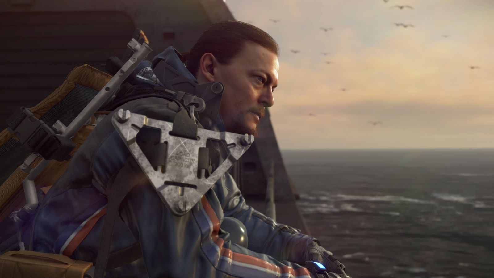
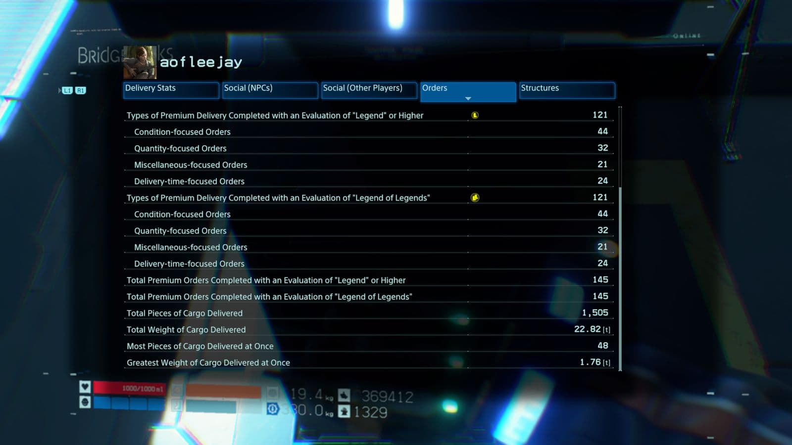
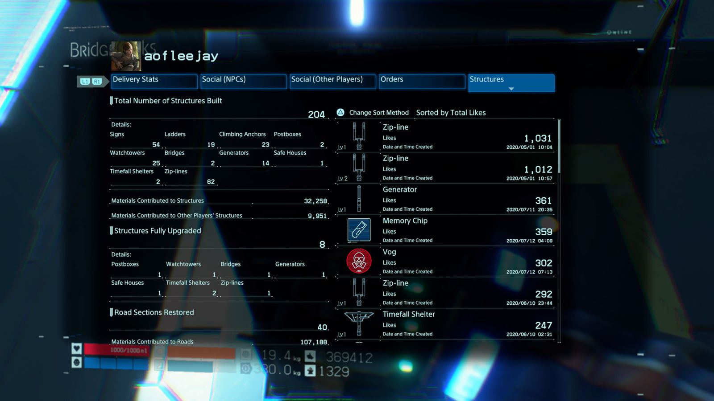
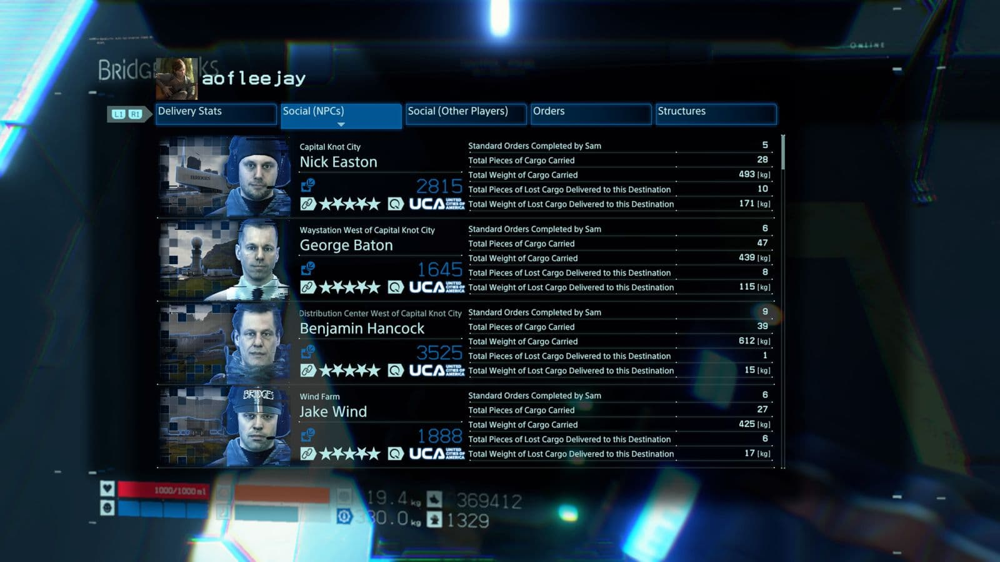
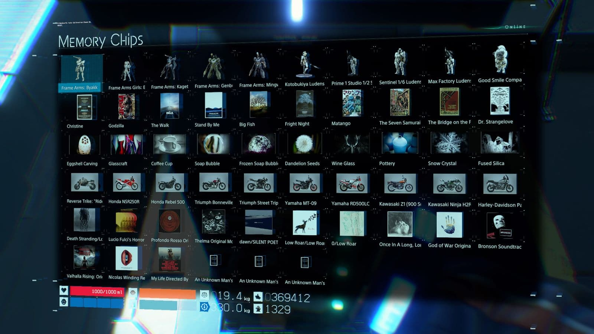
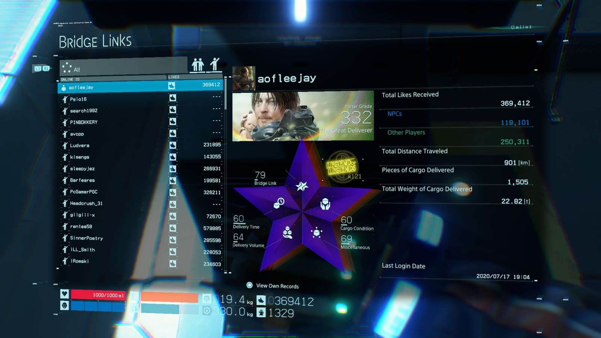
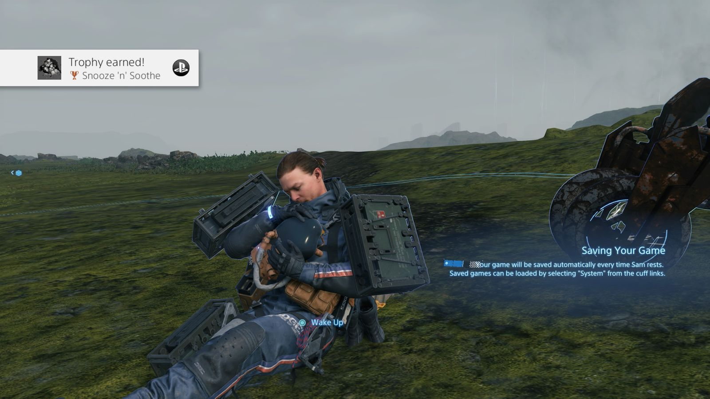
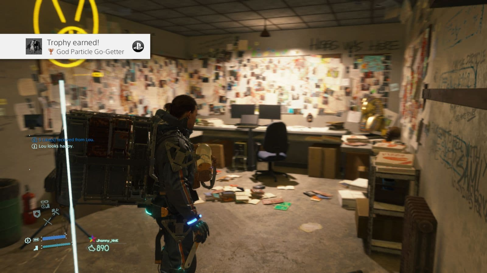
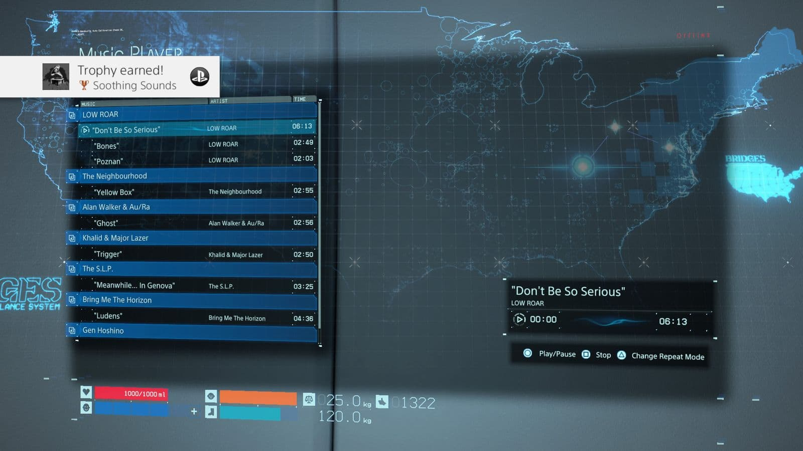

หลังจากใช้เวลาราว 96 ชั่วโมงกับการไล่เก็บถ้วยแพลตตินัม เลยเขียนบทความเก็บไว้สักหน่อย

> บทความนี้มีการเปิดเผยเนื้อหาภายในเกม และมีการใส่ความเห็นส่วนตัว ประสบการณ์จริงที่ได้รับอาจแตกต่างกันไป

> เปอร์เซ็นต์ของผู้ที่ได้รับถ้วยรางวัลอ้างอิงจากวันที่ 17/07/20

---

---

## ถ้วยรางวัลทั้งหมด (63 ถ้วย)

- **Greatest of Great Deliverers** (2.7%) - ได้ถ้วยรางวัลครบทุกถ้วย

  ถ้วยนี้เป็นถ้วยสุดท้ายที่จะได้รับ หลังจากได้ถ้วยรางวัลที่เหลือครบแล้วก็จะได้ถ้วยนี้แบบอัตโนมัติ

---

เกมนี้จะเล่าเรื่องเป็นตอนๆ ทั้งหมด 15 ตอน เมื่อเล่นแต่ละตอนจบจะได้ถ้วยรางวัลมา

- **Delivering Is What I Do** (97.1%) - เล่นเนื้อเรื่องจบ prologue: Porter
- **Rebuilding America** (90.0%) - เล่นเนื้อเรื่องจบ Episode 1: Bridget
- **We Need You** (58.0%) - เล่นเนื้อเรื่องจบ Episode 2: Amelie
- **I Won’t Break** (42.9%) - เล่นเนื้อเรื่องจบ Episode 3: Fragile
- **BB...** (42.6%) - เล่นเนื้อเรื่องจบ Episode 4: Unger
- **We’re Whole Again** (38.0%) - เล่นเนื้อเรื่องจบ Episode 5: Mama
- **BBs: A Bridge Between This World and the One Beyond** (35.5%) - เล่นเนื้อเรื่องจบ Episode 6: Deadman
- **“BB”** (35.4%) - เล่นเนื้อเรื่องจบ Episode 7: Clifford
- **Sixty Deaths and Sixty Births in a Day** (32.3%) - เล่นเนื้อเรื่องจบ Episode 8: Heartman
- **The Particle of God** (31.6%) - เล่นเนื้อเรื่องจบ Episode 9: Higgs
- **I’m Your Die-Hardman** (31.2%) - เล่นเนื้อเรื่องจบ Episode 10: Die-Hardman
- **Bring Back My Baby** (30.9%) - เล่นเนื้อเรื่องจบ Episode 11: Clifford Unger
- **She’s waiting for you on the Beach.** (30.6%) - เล่นเนื้อเรื่องจบ Episode 12: Bridges
- **Thank You, Sam** (30.2%) - เล่นเนื้อเรื่องจบ Episode 13: Sam Strand
- **Thanks for Everything** (29.3%) - เล่นเนื้อเรื่องจบ Episode 14: Lou

---

- **Everyday Delivery** (62.7%) - ส่ง standard order ครั้งแรก
- **Deliveries Done** (29.1%) - ส่ง standard order รวม 36 order

  Standard order อีกมุมนึงก็เหมือนเควสเสริมครับ สามารถรับได้ที่ delivery terminal เลย ใครที่ขยันส่งของหน่อยสามารถได้สองถ้วยนี้ก่อนจบเนื้อเรื่องนะครับ อีกอย่างการส่ง standard order ก็จะช่วยเพิ่มความสัมพันธ์ของเรากับสถานที่ต่างๆ ทำให้ได้อุปกรณ์ดีๆมาใช้ระหว่างเกมด้วย **และถ้าจะเก็บถ้วยแพลตตินัมแล้ว ยังไงก็ได้รับสองถ้วยนี้แน่นอนครับ**

---

- **Birth of a Legend** (4.7%) - ส่ง **10** premium delivery ในแต่ละประเภท โดยต้องได้ระดับ S ในการส่งแต่ละครั้ง
- **Growth of a Legend** (3.0%) - ส่ง **20** premium delivery ในแต่ละประเภท โดยต้องได้ระดับ S ในการส่งแต่ละครั้ง

  สองถ้วยนี้ใช้เวลาในการเก็บนานและเป็นถ้วยท้ายๆที่จะได้เลยครับ มีรายละเอียดพอสมควรดังนี้ครับ

  1. **การจะได้ premium delivery ก่อนอื่นต้องเล่นเกมในโหมด hard เท่านั้น** (ใครเล่น normal สามารถเปลี่ยนได้ ไม่ต้องเริ่มเล่นใหม่) โดยตอนรับออเดอร์จะสามารถ**กดปุ่มทิศทางขวา เพื่อเปลี่ยนเป็น premium delivery** ได้ ซึ่งเงื่อนไขก็จะยากกว่าปกติ และเราต้องทำให้ได้ rank S ถึงจะนับว่าสำเร็จ

  2. **ตัวออเดอร์จะแบ่งออกเป็น 4 ประเภท** ได้แก่ **condition** เน้นของไม่เสียหาย, **quantity** เน้นปริมาณกล่องที่ต้องส่ง, **delivery time** เน้นความเร็ว และ **miscellaneous** ภารกิจอื่นๆ เช่น หาของที่ตามจุดต่างๆ, เอาของคืนจากพวก MULEs

  ถ้าอยากรู้ว่าทำไปถึงไหนแล้วสามารถดูใน Bridge Links ได้โดยกด **Option -> Bridge Links -> เลือกแท็บ Orders** จะอยู่ในหัวข้อ **Types of Premium Delivery Completed with an Evaluation of "Legend of Legends"**

  

---

- **A Helping Hand** (14.9%) - ขอให้ผู้เล่นคนอื่นส่งของให้ครั้งแรก

  สามารถทำได้ช่วงกลางๆเกม โดยเลือก **Option -> Supply Requests** จากนั้นทำการเลือกสิ่งของที่ต้องการ ก็จะปลดล็อคถ้วยรางวัลครับ

---

- **The Automation Revolution** (47.6%) - ส่งสินค้าด้วย bot ครั้งแรก

  **ได้ตามเนื้อเรื่อง** โดยช่วงกลางๆเกม จะสามารถใช้ bot ส่งสินค้าได้ โดย**ไปที่ delivery terminal และเลือก Standard Orders (Bot-deliverable)** เมื่อ bot เดินทางไปส่งสินค้าจนเสร็จก็จะได้ถ้วยนี้มาครับ

---

- **Apprentice Builder** (84.3%) - สร้างสิ่งก่อสร้าง หรือสัญลักษณ์ หรือใช้อุปกรณ์ครั้งแรก
- **Master Builder** (8.8%) - สร้างสิ่งก่อสร้างอย่างละ 1 ชิ้น

  สิ่งก่อสร้าง ต้องใช้ PCC มีทั้งหมด 7 แบบ ดังนี้

  - Postbox
  - Watchtower
  - Bridge
  - Generator
  - Safe House
  - Timefall Shelter
  - Zip-line

  สามารถกดดูว่าเราสร้างสิ่งก่อสร้างไปเท่าไหร่แล้ว โดยเลือก **Option -> Bridge Links -> Structures** จะอยู่ในหัวข้อ **Total Number of Structures Built** ครับ

  

---

- **A New Day for the UCA** (83.8%) - เชื่อมต่อ facility หนึ่งแห่งเข้ากับ UCA
- **In Sam We Trust** (4.6%) - เชื่อมต่อ facility ทั้งหมดเข้ากับ UCA
- **Well Connected** (75.0%) - ได้ความสัมพันธ์ 3 ดาว กับ facility หนึ่งแห่ง
- **Best Beloved** (4.0%) - ได้ความสัมพันธ์ 5 ดาวกับทุก facility

  ปลายทางของถ้วยรางวัลสี่ถ้วยนี้คือ Best Beloved ครับ ที่เหลือเป็นทางผ่าน
  อย่างแรกต้องหา facility และที่พักของ prepper ทั้งหมดให้เจอก่อนครับ เพราะถ้าเล่นตามเนื้อเรื่องอย่างเดียวจะเจอไม่ครบ นี่คือรายชื่อของ prepper ที่ไม่เจอในภารกิจหลักครับ

  - Luden's Fan
  - Musician
  - Collector
  - Veteran Porter
  - Novelist's son
  - First Prepper

  บางคนก็อาจจะยังไม่เข้าร่วมกับ UCA ตั้งแต่เจอกันครั้งแรก อาจจะต้องทำภารกิจหรือหา lost cargo ไปส่งเพื่อเพิ่มความสัมพันธ์กับเขาครับ

  ปล. ถ้าส่งของแล้วความสัมพันธ์ไม่ค่อยเพิ่มขึ้นเลย แนะนำให้ไปนอนพักก่อน รอจนได้รับอีเมลจากคนเหล่านั้นแล้วค่อยไปเพิ่มความสัมพันธ์ต่อครับ

  สามารถดูความสัมพันธ์ได้ที่ **Option -> Bridge Links -> แท็บ Social (NPCs)** ครับ

  

---

- **Like and Be Liked** (88.9%) - กดไลค์ให้สิ่งก่อสร้างครั้งแรก

  กดไลค์ให้กับสิ่งก่อสร้าง, สัญลักษณ์ หรืออุปกรณ์สักชิ้นก็จะได้ถ้วยรางวัลมาเลยครับ

  

---

- **The People’s Porter** (69.4%) - ได้ 2,400 ไลค์
- **The World’s Most Popular Porter** (36.8%) - ได้ 50,000 ไลค์

  ทำภารกิจก็จะได้ไลค์จาก NPC หรือสร้างสิ่งก่อสร้างก็อาจจะได้ไลค์จากผู้เล่นคนอื่นในเกม **และถ้าจะเก็บถ้วยแพลตตินัมแล้วยังไงก็ได้รับสองถ้วยนี้แน่นอนครับ**

---

- **Good Samaritan** (95.7%) - ส่ง lost cargo ชิ้นแรก

  หา lost cargo ที่ตกอยู่ตามทางไปส่งสักชิ้นก็จะได้ถ้วยรางวัลมาครับ

---

- **Giver of Gifts** (50.8%) - บริจาคของครั้งแรก

  เราสามารถเอาของไปให้ผู้เล่นคนอื่นใช้ได้ ผ่าน share locker ครับ โดยไปที่ delivery terminal แล้วเลือก **Share Locker -> Donate Weapons & Equipment** แล้วเลือกให้ของสักชิ้น ก็จะได้ถ้วยรางวัลมาครับ

---

- **Chiral Crafter** (72.3%) - รีไซเคิล chiral crystal ครั้งแรก

  **ได้ตามเนื้อเรื่อง**หลังจากรีไซเคิล chiral crystal เป็นครั้งแรกครับ

---

- **A Thirst for Knowledge** (56.6%) - กู้คืน memory chip อันแรก
- **Fount of Knowledge** (3.0%) - กู้คืน memory chip ทั้งหมด

  Memory chip มีทั้งหมด **56** อัน และกระจัดกระจายอยู่ในทุกที่ ถ้าไม่อยากเปิดบทสรุปก็อาศัยดูตามสัญลักษณ์ที่ผู้เล่นคนอื่นๆสร้างไว้ หรือใช้ watchtower ในการส่องหาก็ได้ เมื่อได้ memory chip มาแล้ว สามารถเอามากู้คืนที่ได้ delivery terminal ครับ

  

---

- **The Custom Kid** (73.9%) - ได้ของไว้ปรับแต่งสิ่งก่อสร้าง

  **ได้ตามเนื้อเรื่อง**

---

- **Soak and Sigh** (34.4%) - แช่บ่อน้ำร้อนครั้งแรก

  บ่อน้ำร้อนมีทั้งหมด 7 แห่ง ไม่จำเป็นต้องหาให้ครบนะครับ แค่เจอแล้วลงไปแช่ก็จะได้ถ้วยรางวัลนี้มาครับ

  

---

- **The Post Guides the Present** (17.0%) - อ่านอีเมล 100 ฉบับ
- **The Past Guides the Present** (7.5%) - อ่านบทสัมภาษณ์ 100 ฉบับ

  ต้องขยันส่งของกันสักหน่อยครับ แล้วจะมีอีเมล์และบทสัมภาษณ์มาให้เรื่อยๆครับ **แต่ถ้าจะเก็บถ้วยแพลตตินัมแล้วยังไงก็ได้รับสองถ้วยนี้แน่นอนครับ**

---

- **Pathfinder** (45.9%) - ช่วยให้ porter เดินทางในเขต MULEs หรือ Terrorist ได้

  จัดการพวก MULEs หรือ Terrorist ให้หมดทั้งค่ายก็จะได้ถ้วยรางวัลมาครับ

---

- **Childminder** (17.3%) - ได้ความสัมพันธ์ 5 ดาว กับ BB
- **A Baby Blessing** (80.4%) - ได้ไลค์แรกจาก BB

  หลักๆคือเล่นกับน้องบ่อยๆครับ เข้าที่พักก็ไปกดเล่นกับน้องบ้าง ผมทำแค่นี้ ช่วงท้ายๆเกมก็ได้ถ้วยรางวัลมาครับ

---

- **Prominent Porter** (76.8%) - ได้ระดับการขนส่ง 10 ในประเภทใดก็ได้
- **Great Deliverer** (3.2%) - ได้ระดับการขนส่ง 60 ในทุกประเภท

  ระดับการขนส่งทั้ง 4 ประเภทคือ

  - **Delivery Time** - ทำภารกิจที่มีการจับเวลาเยอะๆ
  - **Cargo Condtion** - ทำภารกิจที่สั่งให้เรารักษาสภาพสินค้า
  - **Delivery Volume** - ทำภารกิจที่ให้เราส่งของปริมาณมาก
  - **Miscellaneous** - ทำภารกิจเบ็ดเตล็ดเยอะๆ เช่น หาของ, เอาของคืนจาก MULEs

  สามารถเข้าดูระดับของตัวละครได้ที่ **Option -> Bridge Links** ครับ

  

---

- **Catcher Crusher** (58.6%) - เอาชนะ catcher

  **ได้ตามเนื้อเรื่อง**หลังจากเอาชนะ catcher ได้

---

- **Snooze ’n’ Soothe** (65.2%) - ฟื้นฟูตัวเองจากการนอนหลับครั้งแรก

  เราสามารถกดโอค้างเพื่อนั่งพักแล้วกดสี่เหลี่ยมเพื่อนอนหลับพักผ่อนได้ แค่นี้ก็จะได้ถ้วยรางวัลมาครับ

  

---

- **Boots Are a Porter’s Best Friend** (72.3%) - เปลี่ยนรองเท้าครั้งแรก

---

- **Hooked on Delivering!?** (16.3%) - ส่งสินค้ารวม 700 ชิ้น
- **Pumped Porter** (34.7%) - ส่งสินค้ารวม 3,000 Kg
- **Well-Traveled** (47.9%) - เดินทาง 80 Km เพื่อส่งสินค้า

  ถ้วยรางวัลสำหรับสายขยันครับ **แต่ถ้าจะเก็บถ้วยแพลตตินัมแล้วยังไงก็ได้รับสามถ้วยนี้แน่นอนครับ**

---

- **God Particle Go-Getter** (12.4%) - เจอห้องของ Higgs

  ระหว่างเล่นเกมหลายๆคนน่าจะเจอภารกิจให้ส่งพิซซ่าไปที่ที่พักของ **Peter Englert** อยู่บ้างนะครับ จริงๆมันคือที่พักของ Higgs นั่นเองครับ หลังจากเอาชนะเขาได้จะพบห้องของเขาเปิดอยู่ที่นี่ครับ เข้าไปก็จะได้ถ้วยรางวัลนี้มา

  

---

- **Rest In Pieces** (31.2%) - ตัดสายสะดือ BTs ครั้งแรก

  กลางๆเกม Cufflink ของเราจะสามารถตัดสายสะดือของพวก BTs ได้ สามารถทำได้โดยย่องเข้าไปใกล้ๆตัวมัน เมื่อใกล้มากพอจะสามารถกดตัดสายสะดือได้ครับ เมื่อทำแล้วจะได้ถ้วยรางวัลมาครับ

---

- **Any Porter in a Storm** (8.7%) - แลกของกับ Porter ในเกมครั้งแรก

  เมื่อเล่นไปสักช่วงหนึ่งจะเจอ NPC คนส่งของคนอื่นๆเดินอยู่ภายในเกม เขาจะพกกล่องใส่ของติดตัวไปด้วย อันนั้นแหละครับที่เราต้องไปแลกมา โดยเอากล่องของเราไปวางไว้ข้างหน้าของคนส่งของเลยครับ เขาจะยื่นกล่องของเขามาให้ เรารับไว้ก็จะได้ถ้วยรางวัลนี้ทันทีครับ

---

- **Sleep Tight, Little BB** (65.1%) - ปลอบ BB จนหยุดร้องไห้ครั้งแรก

  เวลาตกจากที่สูง, จมน้ำ หรือเจอพวก BTs น้องจะร้องครับ หาจังหวะปลอบน้องด้วยการเขย่าจอยโอ๋ๆน้อง พอน้องหยุดร้องได้ก็จะได้ถ้วยรางวัลมาครับ

  

---

- **A Shout in the Dark** (70.0%) - ตะโกนแล้วมีคนตอบครั้งแรก

  ไปกดตะโกนใกล้ๆกับสิ่งก่อสร้างที่คนอื่นสร้างไว้ครับ จะมีเสียงตอบกลับมา และจะได้ถ้วยรางวัลทันทีครับ

---

- **Public Service Porter** (17.3%) - ทำลายกล่อง chiralium ครั้งแรก

  ตรงที่พักของ junk dealer จะมีขยะอยู่ครับ ให้เอาไปทำลายที่ crater lake ที่เป็นทะเลสาบสีดำตรงทิศเหนือของ South Knot City ครับ โยนกล่องไปในทะเลสาบเลยก็จะได้ถ้วยรางวัลมาครับ

---

- **Trail-Blazer** (3.5%) - อัพเกรดสิ่งก่อสร้างทุกชนิดจนถึงเลเวลสูงสุด

  สิ่งก่อสร้างจะเต็มที่เลเวล 3 ครับ เราสามารถหาสิ่งก่อสร้างเลเวล 2 แล้วไปเติมวัตถุดิบให้เต็มก็ได้ครับ ทำกับสิ่งก่อสร้างจนครบทุกชนิดก็จะได้ถ้วยมาครับ

  สามารถดูรายละเอียดของสิ่งก่อสร้างที่เราเคยอัพเกรดได้โดยกด **Option -> Bridge Links -> Structures** จะอยู่ในส่วนของ **Structures Fully Upgraded** ครับ

  

---

- **I Couldn’t Hold it In!** (65.4%) - ฉี่ข้างนอกครั้งแรก

---

- **All Roads Lead to the UCA** (49.5%) - สร้างถนนครั้งแรก

  **ได้ตามเนื้อเรื่อง**จากภารกิจที่ให้ไปสร้างถนนเส้นแรก ไม่ต้องสร้างจนครบแค่สร้างจุดแรกก็จะได้ถ้วยรางวัลมาเลย

---

- **Soothing Sounds** (57.5%) - เล่นเพลงจาก Music Player

  เริ่มจากในห้องพักของเรา โดย**เข้าไปที่แผนที่ UCA ตรงฝาผนังแล้วกด Option -> Music Player** ลองเลือกเพลงดูก็จะได้ถ้วยรางวัลมาครับ

  

---

- **Building Bridges** (73.5%) - ได้ Bridge Link lv.1

  ทำได้โดยการได้ไลค์จากผู้เล่นออนไลน์คนอื่นๆ เราแค่ไปสร้างสิ่งก่อสร้างไว้ เดี๋ยวก็จะมีคนมากดไลค์เองครับ

---

- **Homo Faber** (3.0%) - สร้างของครบทุกชนิด

  เราสามารถสร้างของในเกมได้ทั้งหมด 72 ชนิด บางชนิดสามารถสร้างได้เลย แต่บางชนิดอาจต้องเพิ่มความสัมพันธ์กับ facility ต่างๆก่อนจึงจะสร้างได้

  จะมีมอเตอร์ไซค์คันนึงสร้างได้จากการเก็บ memory chip ครับ เมื่อสร้างจนครบก็จะได้ถ้วยรางวัลมา

---

## Tips ที่ผมใช้

### ทำถนนให้หมดทุกจุด

เกมนี้มีจุดทำถนนทั้งหมด 40 จุด เชื่อมต่อตั้งแต่บนสุด Lake knot city ถึงล่างสุด South knot city และตะวันตกสุด Mountain knot city ค่อยๆไล่ทำจากจุดที่เราเดินทางบ่อยๆก็ได้ครับ

ถึงแม้การสร้างถนนครบทุกจุดจะไม่ได้รับรางวัลอะไร แต่มันจะทำให่เราเดินทางผ่าน facility และที่พักของ perpper บางคนได้สะดวกขึ้นมากๆเลยครับ ที่สำคัญก็จะทำให้เราเก็บถ้วยรางวัลได้ง่ายขึ้นอีกมากเลยครับ

---

### ทำ Zip-line

บางจุดที่ถนนไปไม่ถึงสามารถต่อ zip-line เพื่อความสะดวกได้ครับ หรือถ้าวางดีๆสามารถเดินทางข้ามฟากเลยก็ได้ เช่น จาก moutain knot city ทะลุมา timefall farm ทะลุไปยัง cosplayer เลยก็ได้เช่นกัน

เราสามารถอัพเกรด zip-line เพื่อเพิ่มระยะระหว่าง zip-line สองจุดให้ยาวขึ้นได้ด้วย

พยายามเช็คดูบ่อยๆว่า zip-line ตัวไหนใกล้พังแล้วบ้าง ให้รีบไปซ่อม เพราะถ้าเกิดมันพังขึ้นมานี่เดินกันขาลากแน่นอนครับ

---

### เล่นแบบ hard แต่แรกน่าจะได้ถ้วยไวกว่า

เริ่มแรกผมเล่นด้วยความยากระดับ normal จนมารู้ทีหลังว่ามีสองถ้วยคือ **Birth of a Legend** และ **Growth of a Legend** ที่ต้องเล่นในระดับความยาก hard ซึ่งเราสามารถเปลี่ยนมาเล่น hard ได้ภายหลังครับ แต่ถ้าเริ่มเล่นแบบ hard แต่แรกผมว่าน่าจะใช้เวลาเก็บถ้วยน้อยกว่านี้ครับ

---

### เคลียร์ค่าย MULEs ก่อนค่อยรับภารกิจ

บางภารกิจที่ให้เราไปเอาของจากพวก MULEs หลายครั้งผมเลือกที่จะไปถล่มค่ายของพวกมันก่อน แล้วค่อยรับภารกิจทีหลัง เหมาะกับภารกิจที่ต้องทำเวลาให้เร็วที่สุด หรือเพื่อเลี่ยงการปะทะสำหรับภารกิจที่ต้องดูแลให้ของไม่เสียหายครับ

---

สรุปนี่เป็นอีกหนึ่งบันทึกที่เอามาแบ่งบันกัน หากตรงไหนมีข้อผิดพลาดสามารถคอมเม้นแจ้งไว้ได้เลยนะครับ :)
