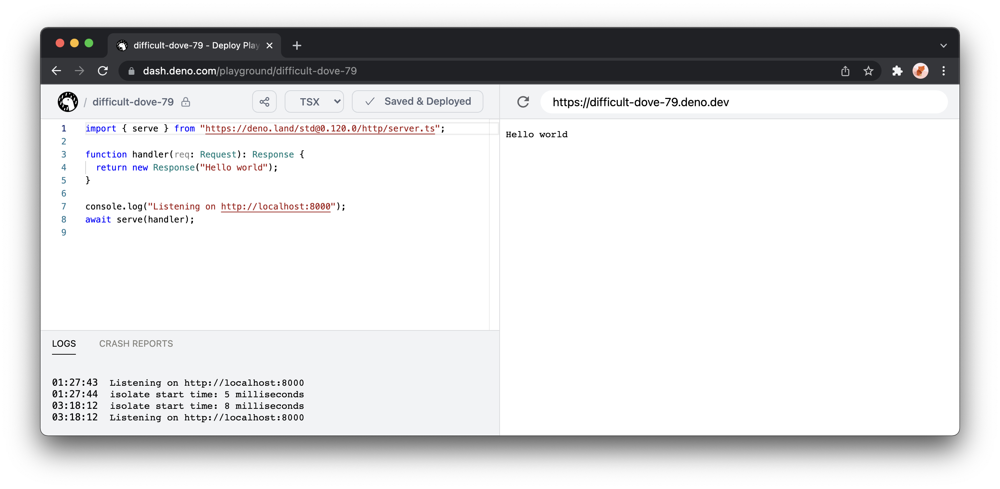

เมื่อไม่นานมานี้อยากลองขึ้นโปรเจคด้วย TypeScript แบบเร็ว ๆ แล้วไปเจอมาว่ามีรันไทม์ตัวนึงชื่อ <a href="https://deno.land/" target="_blank">Deno</a> (หมุนอักษรจาก Node และคนทำคนเดียวกัน) โดยซัพพอร์ท TypeScript แบบ build-in มาเลย ก็เลยหยิบมาลองเล่นดู เลยเป็นที่มาของบทความนี้ครับ

---

## มาถึง Hello World ก่อนเลย

สำหรับชาว Mac ก็ติดตั้งง่าย ๆ ผ่าน Homebrew ได้เลย

```
❯ brew install deno
```

แล้วเราก็สามารถสร้างไฟล์นามสกุล **.ts** ขึ้นมาใช้งานได้เลย

```typescript
// index.ts
const add = (a: number, b: number) => a + b

console.log(add(1, 2))
```

สั่ง **deno run index.ts** ก็จะได้ผลลัพธ์ที่ต้องการ โดยไม่ต้องลง TypeScript compiler แยกเลย

```
❯ deno run index.ts
Check file:///index.ts
3
```

---

## เล่น Library กันอีกหน่อย

งานที่ผมอยากทำก็เป็น API โดย Deno ก็มี library พื้นฐานอย่าง <a href="https://deno.land/std/http" target="_blank">http</a> ที่เป็น <a href="https://deno.land/std" target="_blank">standard library</a> ให้ใช้ได้เลย แต่ส่วนตัวอยากได้ตัวจัดการ router ด้วย เลยเลือกใช้ <a href="https://deno.land/x/oak" target="_blank">oak</a> (หมุนอักษรจาก koa) ที่เป็น third party library เอามาใช้งาน

อีกสิ่งนึงที่ต่างกับ Node ก็คือเราจะใช้การ import library ผ่าน url แทน

```typescript
import { Application, Router } from 'https://deno.land/x/oak/mod.ts'

const app = new Application()
const router = new Router()

router.get('/', (ctx) => {
  ctx.response.body = { status: 'ok' }
})

app.use(router.routes())
app.use(router.allowedMethods())

await app.listen({ port: 8000 })
```

โดย Deno จะรันแบบ secure by default คือโค้ดด้านบนจะมีการใช้ network ตอนรันก็เลยต้องขอ permission ก่อน จึงต้องเพิ่ม flag **allow-net** เข้าไปตอนรันด้วย (อยากเข้าถึงส่วนอื่น ๆ เช่น  file system, env ก็ไปใส่ flag ตามที่ใช้งาน ไม่งั้นจะรันไม่ได้นะ)

```
❯ deno run --allow-net index.ts
```

---

## Build-in Tools

สิ่งนึงที่ชอบก็คือ Deno มาพร้อมเครื่องมือสำหรับการ ship, format, test, watch code พร้อมเลย เช่น
- อยาก build เป็น binary ก็สามารถใช้ **deno compile**
- อยากรีโหลดโค้ดอัตโนมัติตอนแก้ไขไฟล์ ก็ใช้ **deno run --watch index.ts**
- อยากจัด format โค้ด ก็ใช้ **deno fmt**
- อยากเขียนเทส ก็ใช้ **deno test**

---

## Deploy ด้วย Deno Deploy

สุดท้ายจะเอาขึ้นให้คนใช้งานก็สามารถใช้ <a href="https://deno.com/deploy" target="_blank">Deno Deploy</a> ในการได้เลย โดยจะ connect ผ่าน Git repository หรือจะสร้างเป็น playground พิมพ์โค้ดผ่าน console ในหน้าเว็บ แล้ว deploy ขึ้นใช้งานเลยก็ได้ สะดวกมาก ๆ ครับ



---

สำหรับใครที่ลองเล่นแล้วก็สามารถเข้ามาเล่าสู่กันฟังได้นะครับ Happy Coding :) ครับผม