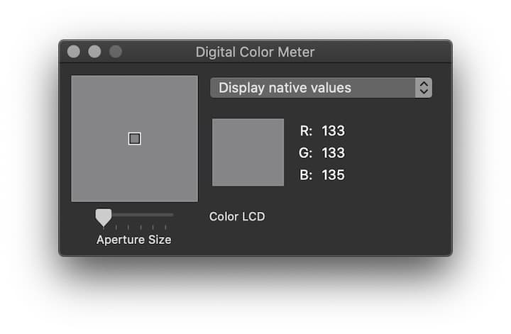
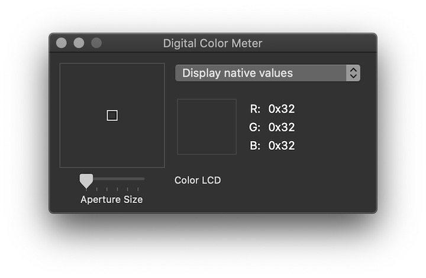

**Digital Color Meter** เป็นแอพติดเครื่องของ MacOS ที่ใช้ดูดสีจากส่วนต่างๆ ของหน้าจอเรา แต่สารภาพว่าผมมองข้ามเครื่องมือตัวนี้มาตลอด เพราะมันดูดสีมาเป็น RGB แต่ที่ผมอยากได้ส่วนใหญ่ผมมักจะเป็น Hexadecimal มากกว่าน่ะ

เดิมทีผมก็ไปหาเว็บแปลงเจ้า RGB เป็น Hexadecimal แต่หลังๆ ชักจะขี้เกียจ เลยคิดว่าไปหาแอพตัวใหม่ดีกว่า แต่พอลองหาข้อมูลดีๆ ถึงได้รู้ว่าเจ้า Digital Color Meter มันก็สามารถดูดสีในฟอร์แมต Hexadecimal ได้เหมือนกัน

วิธีก็แค่เลือก **View -> Display Values -> as Hexadecimal** แล้วก็ก็อปปี้เข้าคลิปบอร์ดด้วย **CMD + Shift + c** แค่นี้ก็เอาไปวางเป็น Hexadecimal ได้แล้วครับ

**ที่มา:** [https://superuser.com/questions/372855/an-application-to-easily-pick-a-color-in-mac-os-x-and-get-the-hex-value](https://superuser.com/questions/372855/an-application-to-easily-pick-a-color-in-mac-os-x-and-get-the-hex-value)
